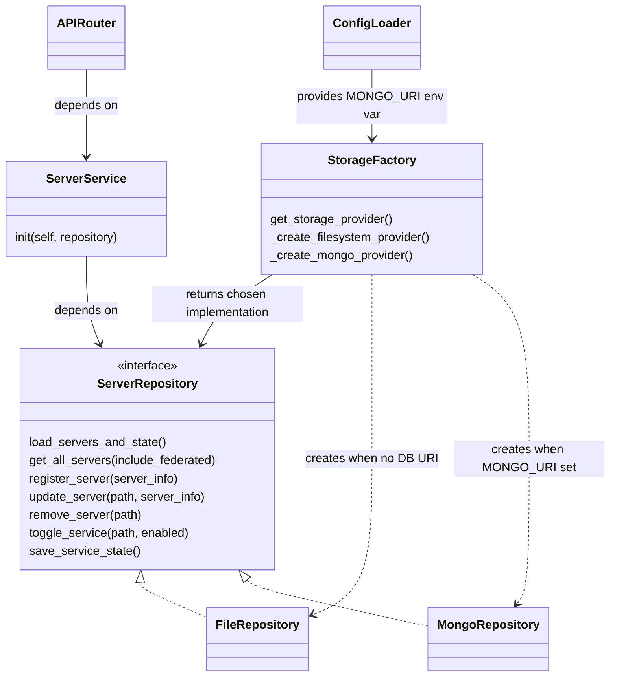

# MCP Gateway MongoDB Integration

Living design document for MongoDB integration

## Table of Contents
- [Introduction](#introduction)
    - [Problem statement](#problem-statement)
    - [Objectives](#objectives)
- [Proposed Architecture](#proposed-architecture)
    - [Data Schema](#data-schema)
    - [Class Diagram](#class-diagram)
    - [Authentication](#authentication)
    - [API Endpoints](#api-endpoints)
- [MongoDB Integration](#mongo-db-integration)
    - [Native Driver](#native-driver)
    - [Object Data Modeler](#object-data-modeler)
- [Additional Considerations](#future-considerations)
    - [Agent Persistence](#agent-persistence)

## Introduction

### Problem statement

Server configuration data is currently persisted to the filesystem as JSON documents stored under `registry/server/*.json`. This approach has limitations for scale, concurrency, and transactional guarantees. A database-backed persistence option (MongoDB) is proposed to address these limitations, while allowing existing file-based behavior to continue.

### Objectives

- Provide a option to persist server configuration to a MongoDB instance
- Ensure server configuration endpoints enforce admin and user authentication scopes.
- Preserve existing file-based storage patterns as a backward-compatible option.


## Proposed Architecture

- Expose `MONGO_URI` env var via application settings (`config.py`)
- Use a factory-pattern to return the correct storage provider, defaulting to the existing file-based implementation
- Update `server_service` to depend on repository interfaces rather than concrete storage implementations

### Class Diagram



- API Router (`registry/api/server_routes.py`): Exposes HTTP endpoints for server operations. Validates requests through role-based access controls set in the `UserContext`
- ServerService: (`registry/services/server_service.py`) 
- ServerInterface: Abstract class for server storage providers 
- FileRepository/MongoRepository: storage-specific server storage implementations

### Data Schema

__Question__: Should the data model for MCP server be compatiable with those used in LibreChat? 


### Authorization 

Permissions checks are contained within the server API router. It uses RBAC helpers found in `registry/auth/dependencies.py`


### API Endpoints
- Admin can add/update/remove server configuration for all of the users
- Admin can add/update/remove server configuration for different groups
- User can add/update/remove their private server configuration


## Mongo DB Integration (TODO)

Investigate Pymongo vs Beanie (recommended for FastAPI)

### Native Driver

### Object Data Modeler

## Additional Considerations

### Agent Persistence

Provide a plan for agent persistence similar to server persistence:
- Model agent card as documents in MongoDB.
- Add repository implementations for agents.
- Preserve existing file-based agent storage as an option during migration.

### DB Metrics / Logging


## Etc. Notes

`registry/api/server_routes.py`
```python
from ..services.server_service import server_service
 
@router.get("/servers")
async def get_servers_json(
        user_context: CurrentUser,
        query: str | None = None,
):
    # Get servers based on user permissions (same logic as root route)
    if user_context['is_admin']:
        all_servers = server_service.get_all_servers()
    else:
        all_servers = server_service.get_all_servers_with_permissions(user_context['accessible_servers'])

```

`registry/services/server_service.py`
```python
from .db.factory import StorageFactory

class ServerService: 
    def __init__(self, storage_provider): 
        self._storage_provider = storage_provider

    def get_all_servers(self): 
        return self._storage_provider.get_all_servers()

    def get_all_servers_with_permissions(self, accessible_servers):
        if accessible_servers is None: 
            return self._storage_provider.get_all_servers()
        else: 
            all_servers = self._storage_provider.get_all_servers()
            return _filter_services_by_user(all_servers)

storage_provider = StorageFactory().get_storage_provider()
server_service = ServerService(storage_provider)
```

`registry/services/db/factory.py`
```python
from ..core.config import settings

class StorageFactory: 
    def __init__(self, storage_provider): 
        self._storage_provider = storage_provider

    def get_storage_provider(self): 
        # load env var from settings

        # return correct provider instance

    def _create_filesystem_provider(): 
        
    def _create_mongodb_providers(): 
```


