<div align="center">


**Unified Agent & MCP Server Registry – Enterprise-Ready Gateway for AI Development Tools**

[](https://github.com/ascending-llc/mcp-gateway-registry/blob/main/LICENSE)
[](https://github.com/ascending-llc/mcp-gateway-registry/releases)

[🚀 Get Running Now](#option-a-pre-built-images-instant-setup) | [Quick Start](docs/macos-setup-guide.md) | [Documentation](docs/) | [Enterprise Features](#enterprise-features) 


</div>

---

## Enterprise Fork for MCP and Agent Governance 
This project is forked from [MCP Gateway & Registry](https://github.com/agentic-community/mcp-gateway-registry) with enhanced capabilities for:
1. Multi-user governance and access control
1. Enterprise system integration
1. Comprehensive tools and agent governance
1. Production-ready implementation and deployment
1. Simplified Architecture & Kubernetes-Native Design
1. Dynamic mcps and agents configuration

---

## What is MCP Gateway & Registry?

The **MCP Gateway & Registry** is a unified, enterprise-ready platform that centralizes access to both MCP Servers and AI Agents using the [Model Context Protocol (MCP)](https://modelcontextprotocol.io/introduction). It serves three core functions:

1. **Unified MCP Server Gateway** – Centralized access point for multiple MCP servers
2. **MCP Servers Registry** – Register, discover, and manage access to MCP servers with unified governance
3. **Agent Registry & A2A Communication Hub** – Agent registration, discovery, governance, and direct agent-to-agent communication through the [A2A (Agent-to-Agent) Protocol](https://a2a-protocol.org/latest/specification/)

The platform integrates with external registries such as Anthropic's MCP Registry (and more to come), providing a single control plane for both tool access, agent orchestration, and agent-to-agent communication patterns.

**Why unified?** Instead of managing hundreds of individual MCP server configurations, agent connections, and separate governance systems across your development teams, this platform provides secure, governed access to curated MCP servers and registered agents through a single, unified control plane.

**Transform this chaos:**
```
❌ AI agents require separate connections to each MCP server
❌ Each developer configures VS Code, Cursor, Claude Code individually
❌ Developers must install and manage MCP servers locally
❌ No standard authentication flow for enterprise tools
❌ Scattered API keys and credentials across tools
❌ No visibility into what tools teams are using
❌ Security risks from unmanaged tool sprawl
❌ No dynamic tool discovery for autonomous agents
❌ No curated tool catalog for multi-tenant environments
❌ A2A provides agent cards but no way for agents to discover other agents
❌ Maintaining separate MCP server and agent registries is a non-starter for governance
❌ Impossible to maintain unified policies across server and agent access
```

**Into this organized approach:**
```
✅ AI agents connect to one gateway, access multiple MCP servers
✅ Single configuration point for VS Code, Cursor, Claude Code
✅ Central IT manages cloud-hosted MCP infrastructure via streamable HTTP
✅ Developers use standard OAuth 2LO/3LO flows for enterprise MCP servers
✅ Centralized credential management with secure vault integration
✅ Complete visibility and audit trail for all tool usage
✅ Enterprise-grade security with governed tool access
✅ Dynamic tool discovery and invocation for autonomous workflows
✅ Registry provides discoverable, curated MCP servers for multi-tenant use
✅ Agents can discover and communicate with other agents through unified Agent Registry
✅ Single control plane for both MCP servers and agent governance
✅ Unified policies and audit trails for both server and agent access
```

```
┌─────────────────────────────────────┐     ┌──────────────────────────────────────────────────────┐
│          BEFORE: Chaos              │     │    AFTER: MCP Gateway & Registry                     │
├─────────────────────────────────────┤     ├──────────────────────────────────────────────────────┤
│                                     │     │                                                      │
│  Developer 1 ──┬──► MCP Server A    │     │  Developer 1 ──┐                  ┌─ MCP Server A    │
│                ├──► MCP Server B    │     │                │                  ├─ MCP Server B    │
│                └──► MCP Server C    │     │  Developer 2 ──┼──► MCP Gateway   │                  │
│                                     │     │                │    & Registry ───┼─ MCP Server C    │
│  Developer 2 ──┬──► MCP Server A    │ ──► │  AI Agent 1 ───┘         │        │                  │
│                ├──► MCP Server D    │     │                          │        ├─ AI Agent 1      │
│                └──► MCP Server E    │     │  AI Agent 2 ──────────────┤        ├─ AI Agent 2     │
│                                     │     │                          │        │                  │
│  AI Agent 1 ───┬──► MCP Server B    │     │  AI Agent 3 ──────────────┘        └─ AI Agent 3     │
│                ├──► MCP Server C    │     │                                                      │
│                └──► MCP Server F    │     │              Single Connection Point                 │
│                                     │     │                                                      │
│  ❌ Multiple connections per user  │     │         ✅ One gateway for all                      │
│  ❌ No centralized control         │     │         ✅ Unified server & agent access            │
│  ❌ Credential sprawl              │     │         ✅ Unified governance & audit trails        │
└─────────────────────────────────────┘     └──────────────────────────────────────────────────────┘
```

> **Note on Agent-to-Agent Communication:** AI Agents discover other AI Agents through the unified Agent Registry and communicate with them **directly** (peer-to-peer) without routing through the MCP Gateway. The Registry handles discovery, authentication, and access control, while agents maintain direct connections for efficient, low-latency communication.


## MCP Tools in Action

[View MCP Tools Demo](docs/img/MCP_tools.gif)


## A2A Agents - Example Implementations

The registry includes two example A2A agents that demonstrate how both human developers and autonomous AI agents can discover, register, and use agents through the unified Agent Registry. Agents can programmatically discover other agents via semantic search and use them through the A2A protocol, enabling dynamic agent composition and autonomous agent orchestration.

### Agent Discovery

**View in Registry UI:**
Open the registry and navigate to the **A2A Agents** tab to browse registered agents with their full metadata, capabilities, and skills.

**Search via Semantic API:**
Agents and developers can search for agents by natural language description:

```bash
# Search for agents that can help book a trip
cli/agent_mgmt.sh search "need an agent to book a trip"
```

**Example Output:**
```
Found 4 agent(s) matching 'need an agent to book a trip':
--------------------------------------------------------------------------------------------------------------
Agent Name                               | Path                      | Score
--------------------------------------------------------------------------------------------------------------
Travel Assistant Agent                   | /travel-assistant-agent   |  0.8610
Flight Booking Agent                     | /flight-booking-agent     |  1.2134
--------------------------------------------------------------------------------------------------------------
```

**Agent Cards:** View the agent card metadata at [agents/a2a/test/](agents/a2a/test/) to see the complete agent definitions including skills, protocols, and capabilities.

For complete agent deployment and testing documentation, see [agents/a2a/README.md](agents/a2a/README.md).

---

## Architecture

The MCP Gateway & Registry provides a unified platform for both autonomous AI agents and AI coding assistants to access enterprise-curated tools through a centralized gateway with comprehensive authentication and governance.

```mermaid
flowchart TB
    subgraph Human_Users["Human Users"]
        User1["Human User 1"]
        User2["Human User 2"]
        UserN["Human User N"]
    end

    subgraph AI_Agents["AI Agents"]
        Agent1["AI Agent 1"]
        Agent2["AI Agent 2"]
        Agent3["AI Agent 3"]
        AgentN["AI Agent N"]
    end

    subgraph EC2_Gateway["<b>MCP Gateway & Registry</b> (Amazon EC2 Instance)"]
        subgraph NGINX["NGINX Reverse Proxy"]
            RP["Reverse Proxy Router"]
        end
        
        subgraph AuthRegistry["Authentication & Registry Services"]
            AuthServer["Auth Server<br/>(Dual Auth)"]
            Registry["Registry<br/>Web UI"]
            RegistryMCP["Registry<br/>MCP Server"]
        end
        
        subgraph LocalMCPServers["Local MCP Servers"]
            MCP_Local1["MCP Server 1"]
            MCP_Local2["MCP Server 2"]
        end
    end
    
    %% Identity Provider
    IdP[Identity Provider<br/>Keycloak/Cognito]
    
    subgraph EKS_Cluster["Amazon EKS/EC2 Cluster"]
        MCP_EKS1["MCP Server 3"]
        MCP_EKS2["MCP Server 4"]
    end
    
    subgraph APIGW_Lambda["Amazon API Gateway + AWS Lambda"]
        API_GW["Amazon API Gateway"]
        Lambda1["AWS Lambda Function 1"]
        Lambda2["AWS Lambda Function 2"]
    end
    
    subgraph External_Systems["External Data Sources & APIs"]
        DB1[(Database 1)]
        DB2[(Database 2)]
        API1["External API 1"]
        API2["External API 2"]
        API3["External API 3"]
    end
    
    %% Connections from Human Users
    User1 -->|Web Browser<br>Authentication| IdP
    User2 -->|Web Browser<br>Authentication| IdP
    UserN -->|Web Browser<br>Authentication| IdP
    User1 -->|Web Browser<br>HTTPS| Registry
    User2 -->|Web Browser<br>HTTPS| Registry
    UserN -->|Web Browser<br>HTTPS| Registry
    
    %% Connections from Agents to Gateway
    Agent1 -->|MCP Protocol<br>SSE with Auth| RP
    Agent2 -->|MCP Protocol<br>SSE with Auth| RP
    Agent3 -->|MCP Protocol<br>Streamable HTTP with Auth| RP
    AgentN -->|MCP Protocol<br>Streamable HTTP with Auth| RP
    
    %% Auth flow connections
    RP -->|Auth validation| AuthServer
    AuthServer -.->|Validate credentials| IdP
    Registry -.->|User authentication| IdP
    RP -->|Tool discovery| RegistryMCP
    RP -->|Web UI access| Registry
    
    %% Connections from Gateway to MCP Servers
    RP -->|SSE| MCP_Local1
    RP -->|SSE| MCP_Local2
    RP -->|SSE| MCP_EKS1
    RP -->|SSE| MCP_EKS2
    RP -->|Streamable HTTP| API_GW
    
    %% Connections within API GW + Lambda
    API_GW --> Lambda1
    API_GW --> Lambda2
    
    %% Connections to External Systems
    MCP_Local1 -->|Tool Connection| DB1
    MCP_Local2 -->|Tool Connection| DB2
    MCP_EKS1 -->|Tool Connection| API1
    MCP_EKS2 -->|Tool Connection| API2
    Lambda1 -->|Tool Connection| API3

    %% Style definitions
    classDef user fill:#fff9c4,stroke:#f57f17,stroke-width:2px
    classDef agent fill:#e1f5fe,stroke:#29b6f6,stroke-width:2px
    classDef gateway fill:#e8f5e9,stroke:#66bb6a,stroke-width:2px
    classDef nginx fill:#f3e5f5,stroke:#ab47bc,stroke-width:2px
    classDef mcpServer fill:#fff3e0,stroke:#ffa726,stroke-width:2px
    classDef eks fill:#ede7f6,stroke:#7e57c2,stroke-width:2px
    classDef apiGw fill:#fce4ec,stroke:#ec407a,stroke-width:2px
    classDef lambda fill:#ffebee,stroke:#ef5350,stroke-width:2px
    classDef dataSource fill:#e3f2fd,stroke:#2196f3,stroke-width:2px
    
    %% Apply styles
    class User1,User2,UserN user
    class Agent1,Agent2,Agent3,AgentN agent
    class EC2_Gateway,NGINX gateway
    class RP nginx
    class AuthServer,Registry,RegistryMCP gateway
    class IdP apiGw
    class MCP_Local1,MCP_Local2 mcpServer
    class EKS_Cluster,MCP_EKS1,MCP_EKS2 eks
    class API_GW apiGw
    class Lambda1,Lambda2 lambda
    class DB1,DB2,API1,API2,API3 dataSource
```



**Key Architectural Benefits:**
- **Unified Gateway**: Single point of access for both AI agents and human developers through coding assistants
- **Dual Authentication**: Supports both human user authentication and machine-to-machine agent authentication
- **Scalable Infrastructure**: Nginx reverse proxy with horizontal scaling capabilities
- **Multiple Transports**: SSE and Streamable HTTP support for different client requirements

---

## Key Advantages

### **Enterprise-Grade Security**
- OAuth 2.0/3.0 compliance with IdP integration
- Fine-grained access control at tool and method level  
- Zero-trust network architecture
- Complete audit trails and comprehensive analytics for compliance

### **AI Agent & Developer Experience**
- Single configuration works across autonomous AI agents and AI coding assistants (VS Code, Cursor, Claude Code, Cline)
- Dynamic tool discovery with natural language queries for both agents and humans
- Instant onboarding for new team members and AI agent deployments
- Unified governance for both AI agents and human developers

### **Production Ready**
- Container-native (Docker/Kubernetes)
- Real-time health monitoring and alerting
- Dual authentication supporting both human and machine authentication

---

## Enterprise Features

### AI Agents & Coding Assistants Integration

Transform how both autonomous AI agents and development teams access enterprise tools with centralized governance:

<table>
<tr>
<td width="50%">

<p><em>Enterprise-curated MCP servers accessible through unified gateway</em></p>
</td>
<td width="50%">

<p><em>AI assistants executing approved enterprise tools with governance</em></p>
</td>
</tr>
<tr>
<td colspan="2">

### Observability

Comprehensive real-time metrics and monitoring through Grafana dashboards with dual-path storage: SQLite for detailed historical analysis and OpenTelemetry (OTEL) export for integration with Prometheus, CloudWatch, Datadog, and other monitoring platforms. Track authentication events, tool executions, discovery queries, and system performance metrics. [Learn more](docs/OBSERVABILITY.md)


<p><em>Real-time metrics and observability dashboard tracking server health, tool usage, and authentication events</em></p>
</td>
</tr>
</table>

### Anthropic MCP Registry Integration

Seamlessly integrate with Anthropic's official MCP Registry to import and access curated MCP servers through your gateway:

- **Import Servers**: Select and import desired servers from Anthropic's registry with a single command
- **Unified Access**: Access imported servers through your gateway with centralized authentication and governance
- **API Compatibility**: Full support for Anthropic's Registry REST API specification - point your Anthropic API clients to this registry to discover available servers


<p><em>Import and access curated MCP servers from Anthropic's official registry</em></p>

[Import Guide](docs/anthropic-registry-import.md) | [Registry API Documentation](docs/anthropic_registry_api.md)

### Federation - External Registry Integration

**Unified Multi-Registry Access:**
- **Anthropic MCP Registry** - Import curated MCP servers with purple `ANTHROPIC` visual tags
- **Workday ASOR** - Import AI agents from Agent System of Record with orange `ASOR` visual tags  
- **Automatic Sync** - Scheduled synchronization with external registries
- **Visual Identification** - Clear visual tags distinguish federation sources in the UI
- **Centralized Management** - Single control plane for all federated servers and agents

**Quick Setup:**
```bash
# Configure federation sources
echo 'ASOR_ACCESS_TOKEN=your_token' >> .env

# Update federation.json with your sources
# Restart services
./build_and_run.sh
```

[**📖 Complete Federation Guide**](docs/federation.md) - Environment setup, authentication, configuration, and troubleshooting

### Security Scanning

**Integrated Vulnerability Detection:**
- **Automated Security Scanning** - Integrated vulnerability scanning for MCP servers using [Cisco AI Defence MCP Scanner](https://github.com/cisco-ai-defense/mcp-scanner), with automatic scans during registration and support for periodic registry-wide scans
- **Detailed Security Reports** - Comprehensive markdown reports with vulnerability details, severity assessments, and remediation recommendations
- **Automatic Protection** - Servers with security issues are automatically disabled with security-pending status to protect your infrastructure
- **Compliance Ready** - Security audit trails and vulnerability tracking for enterprise compliance requirements

### Authentication & Authorization

**Multiple Identity Modes:**
- **Machine-to-Machine (M2M)** - For autonomous AI agents and automated systems
- **Three-Legged OAuth (3LO)** - For external service integration (Atlassian, Google, GitHub)
- **Session-Based** - For human developers using AI coding assistants and web interface

**Supported Identity Providers:** Keycloak, Amazon Cognito, and any OAuth 2.0 compatible provider. [Learn more](docs/auth.md)

**Fine-Grained Permissions:** Tool-level, method-level, team-based, and temporary access controls. [Learn more](docs/scopes.md)

---

## Community

### Get Involved

**Contributing**
- [Contributing Guide](CONTRIBUTING.md) - How to contribute code and documentation
- [Code of Conduct](CODE_OF_CONDUCT.md) - Community guidelines
- [Security Policy](SECURITY.md) - Responsible disclosure process

---

## License

This project is licensed under the Apache-2.0 License - see the [LICENSE](LICENSE) file for details.

---

<div align="center">

**⭐ Star this repository if it helps your organization!**

[Get Started](docs/installation.md) | [Documentation](docs/) | [Contribute](CONTRIBUTING.md)

</div>
