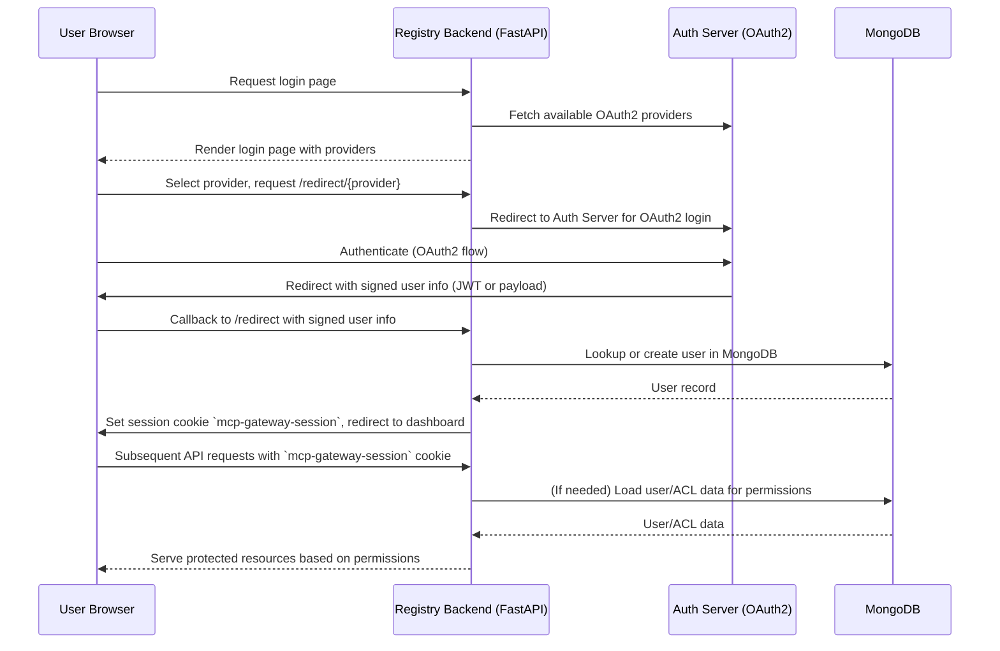

# ACL Service design

## Table of Contents
1. [Introduction](#introduction)
    - [Problem Statement](#problem-statement)
    - [Objectives](#objectives)
2. [Existing Role-Based Permission System](#existing-role-based-permission-system)
    - [Terminology](#terminology)
    - [Existing ACL Service](#existing-acl-service)
    - [Compatibility and Gaps with Current Requirements](#compatibility-and-gaps-with-current-requirements)
    - [Solution: Bridging the Gaps](#solution-bridging-the-gaps)
3. [ACL Service Design](#acl-service-design)
    - [High-Level Authentication & Authorization Sequence Flow](#high-level-authentication--authorization-sequence-flow)
    - [Data Models](#data-models)
    - [Service Design](#service-design)
4. [Jarvis Integration](#jarvis-integration)
    - [Authentication Middleware / JWT Forwarding](#authentication-middleware)
5. [Additional Considerations](#additional-considerations)
    - [Server Registration Form Updates](#server-registration-form-updates)
    - [ACL Service Cache](#acl-service-cache)
6. [Roadmap](#roadmap)
7. [Etc Notes](#etc-notes)


## Introduction

### Problem Statement

The MCP Gateway Registry requires fine-grained Access Control List (ACL) capabilities to support secure environments for MCP servers and A2A agents. Currently, all end users have access to the same set of connectors, which does not meet customer requirements for object-level permissions. To address this, we will introduce an ACL service in the MCP registry project that enables:

- Object-level permissions for servers and agents 
- Control over visibility and access for individual users, user groups, and public (everyone)
- Integration with a MongoDB-backed persistence layer for scalable, transactional storage

This ACL service will be foundational for enforcing secure access and will be compatible with the shared data models and interfaces used in the Jarvis project.

### Objectives

- Design an ACL service that allows admins to share an MCP Server or Agent with:
  - Everyone (public)
  - Specific user groups
  - Specific users
- Ensure compatibility with existing data models and interfaces (as defined in jarvis-api and shared schemas)
- Leverage MongoDB as the single source of truth for ACL metadata and permissions
- Support role-based access control (RBAC) and object-level permissions for all resources

## Existing Role-Based Permission System

An ACLService is already implemented in the Jarvis project. Prior to defining the registry-specific approach, it is essential to review this existing design and assess its compatibility with the updated requirements for sharing connectors (MCP servers and agents) across user, group, and public scopes.

### Terminology
- **Principals**: Entities that can be granted permissions (individual users, groups, public)
- **Roles**: Predefined sets of permissions. Each role is associated with a resource type  and maps to permission bits (permBits) 
- **Resources**: Items that require access control (mcp servers, agents), identified by resourceType and resourceId.
- **Permissions**: Numeric bitmasks that define allowed actions (view, edit).

### Existing ACL Service
The existing [ACLService](https://github.com/ascending-llc/jarvis-api/blob/deploy/packages/api/src/acl/accessControlService.ts) in Jarvis exposes several methods for managing object-level permissions. In the list below, methods that are misaligned with current requirements are shown with strikethroughs, while the remaining methods are candidates for refactoring to meet the updated needs:

- `grantPermission`: Grants permissions to a principal for specific resources using a permission set optionally defined in a role
- `findAccessibleResources`: Finds all resources of a specific type that a user has access to with specific permission bits
- ~~`findPubliclyAccessibleResources`: Find all publicly accessible resources of a specific type~~
- `getResourcePermissionsMap`: Get effective permissions for multiple resources in a batch operation
- `removeAllPermissions`: Removes all permissions for a resource
- `checkPermission`: Checks if a specific user has permissions on a resource
- ~~`validateResourceType`: Validates a resource types and manages permission schemas.~~

**Compatibility with Requirements:**
1. Supports permissions for users, groups, and public.
2. Enables fine-grained control via permission bits and roles.

**Misalignment with Requirements:**
1. Some functions (e.g., `findAccessibleResources`) are user-only and omit groups; others (e.g., `grantPermission`) need refactoring for broader principal support.
2. No automated sync of enums/constants (roles, permission bits) between Jarvis and registry schemas.
3. No mechanism for passing authenticated user context from Jarvis to the registry, blocking accurate permission checks.

**Proposed Solutions**
1. Design the registry ACL service with a minimal, focused set of functions that directly satisfy the current requirements for sharing resources with users, groups, and public, while allowing for future extensibility as additional use cases emerge.

2. Implement automated synchronization of enums and constants (such as roles and permission bits) between Jarvis and the registry project to maintain schema consistency and prevent drift.

3. Use session cookie authentication (`mcp-gateway-session`) for browser/UI users.

## ACL Service Design

### High-Level Authentication & Authorization Sequence Flow

**Note:** Jarvis users authenticate to the registry using a session cookie named `mcp-gateway-session`. This cookie is set after successful login and is included in all subsequent requests to the registry for authentication and permission checks.



### ACL Implementation

#### Field Definitions

Required Fields: 
- `principalType`: String - The type of principal (user, group, or public)
- `principalId?`: Mixed - The ID of the principal (objectId for user/group, null for "public")
- `resourceType`: String - The type of resource (MCP Server, Agent)
- `resourceId`: ObjectId - The ID of the resource
- `permBits`: Number - The permission bits 

Optional Fields:
- `principalModel?`: String - The MongoDB model, null for "public". Can be used to support bulk updates 
- `roleId?:` ObjectId - The ID of the role whose permissions are being inherited 
- `inheritedFrom?`: ObjectId - ID of the resource this permission is inherited from
- `grantedBy?`: ObjectId - ID of the user who granted this permission
- `grantedAt?`: String (ISO 8601) -  When this permission was granted

#### MongoDB Schema Model
MongoDB `ACLEntry`

```bson
{
  _id: ObjectId("..."),
  principalType: "user" | "group" | "public",
  principalId: "..." | null,
  principalModel: "..." | null,
  resourceType: "mcpServer" | "agent"
  resourceId: ObjectId("..."),
  permBits: NumberLong(1),
  roleId: ObjectId("...") | null,
  inheritedFrom: ObjectId("...") | null,
  grantedBy: ObjectId("...") | null,
  grantedAt: ISODate("..."),
  createdAt: ISODate("...")
  updatedAt: ISODate("...")
}
```
**Supporting Enums / Constants**
The `ACLEntry` relies on the following enums/constants exported by `librechat-data-provider`:

- **principalType**
- **principalModel**
- **ResourceType**
- **PermBits**
- **AccessRoleIds**

These enums are not currently imported via `import-schema`. Updates to the `import-schema` tool or an additional import tool will be needed to keep the supporting models in-line with jarvis-api. 


### Service Design

The ACL service provides the following core operations:

1. Grant or update permissions for a principal (user, group, or public) on a resource: `grant_permission`
2. Delete all ACL entries for a resource, optionally filtered by permission bits: `delete_acl_entries_for_resource`
3. Delete a single ACL entry for a resource and principal: `delete_permission`
4. Get a permissions map for a user (across all resources): `get_permissions_map_for_user_id`
5. Search for principals (users, groups) by query string: `search_principals`
6. Get all ACL permissions for a specific resource: `get_resource_permissions`

Example method signatures:

```python
class ACLService:
    async def grant_permission(principal_type: str, principal_id: Optional[Union[PydanticObjectId, str]], resource_type: str, resource_id: PydanticObjectId, role_id: Optional[PydanticObjectId] = None, perm_bits: Optional[int] = None) -> IAclEntry: ...
    async def delete_acl_entries_for_resource(self, resource_type: str, resource_id: PydanticObjectId, perm_bits_to_delete: Optional[int] = None) -> int: ...
    async def delete_permission(self, resource_type: str, resource_id: PydanticObjectId, principal_type: str, principal_id: Optional[Union[PydanticObjectId, str]]) -> int: ...
    async def get_permissions_map_for_user_id(self, principal_type: str, principal_id: PydanticObjectId) -> dict: ...
    async def search_principals(self, query: str, limit: int = 30, principal_types: Optional[List[str]] = None) -> List[dict]: ...
    async def get_resource_permissions(self, resource_type: str, resource_id: PydanticObjectId) -> Dict[str, Any]: ...
```

These methods are implemented in `registry/services/access_control_service.py` and are used by the API routes in `registry/api/v1/acl_routes.py`.

### API Endpoints

The following REST API endpoints are exposed for ACL management:

- **GET `/permissions/search-principals`**
    - **Purpose:** Search for principals (users, groups) by query string for ACL sharing UI and permission assignment.
    - **Query Parameters:**
        - `query` (string, required): The search string for principal name, email, or username.
        - `limit` (int, optional): Maximum number of results to return (default: 30).
        - `principal_types` (list of string, optional): Filter by principal type (e.g., `user`, `group`).
    - **Response:**
        ```json
        [
            {
                "principal_type": "user",
                "principal_id": "<id>",
                "display_name": "..."
            },
        ]
        ```

- **GET `/permissions/{resource_type}/{resource_id}`**
    - **Purpose:** Get all ACL permissions for a specific resource.
    - **Response:**
        ```json
        {
            "permissions": [
                {
                    "principal_type": "user",
                    "principal_id": "<id>",
                    "perm_bits": 1,
                    "role_id": "<role_id>",
                    "granted_at": "2024-01-01T00:00:00Z",
                    "updated_at": "2024-01-01T00:00:00Z"
                },
            ]
        }
        ```

- **PUT `/permissions/{resource_type}/{resource_id}`**
    - **Purpose:** Update ACL permissions for a specific resource.
    - **Request:**
        ```json
        {
            "public": true,
            "removed": [ ... ],
            "updated": [ ... ]
        }
        ```
    - **Response:**
        ```json
        {
            "message": "Updated <count> and deleted <count> permissions",
            "results": {"resource_id": "<id>"}
        }
            ```

## Additional Considerations

### ACL Service Cache
TBD after evaulating performance of initial service implementation
