# ACL Service design

## Table of Contents
1. [Introduction](#introduction)
    - [Problem Statement](#problem-statement)
    - [Objectives](#objectives)
2. [Existing Role-Based Permission System](#existing-role-based-permission-system)
    - [Terminology](#terminology)
    - [Existing ACL Service](#existing-acl-service)
    - [Compatibility and Gaps with Current Requirements](#compatibility-and-gaps-with-current-requirements)
    - [Solution: Bridging the Gaps](#solution-bridging-the-gaps)
3. [ACL Service Design](#acl-service-design)
    - [High-Level Data Flow Diagram](#high-level-data-flow-diagram)
    - [Data Models](#data-models)
    - [Service Design](#service-design)
4. [Jarvis Integration](#jarvis-integration)
    - [Authentication Middleware / JWT Forwarding](#authentication-middleware/jwt-forwarding)
5. [Additional Considerations](#additional-considerations)
    - [Server Registration Form Updates](#server-registration-form-updates)
    - [ACL Service Cache](#acl-service-cache)
6. [Roadmap](#roadmap)
7. [Etc Notes](#etc-notes)


## Introduction

### Problem Statement

The MCP Gateway Registry requires fine-grained Access Control List (ACL) capabilities to support secure environments for MCP servers and A2A agents. Currently, all end users have access to the same set of connectors, which does not meet customer requirements for object-level permissions. To address this, we will introduce an ACL service in the MCP registry project that enables:

- Object-level permissions for servers and agents 
- Control over visibility and access for individual users, user groups, and public (everyone)
- Integration with a MongoDB-backed persistence layer for scalable, transactional storage

This ACL service will be foundational for enforcing secure access and will be compatible with the shared data models and interfaces used in the Jarvis project.

### Objectives

- Design an ACL service that allows admins to share an MCP Server or Agent with:
  - Everyone (public)
  - Specific user groups
  - Specific users
- Ensure compatibility with existing data models and interfaces (as defined in jarvis-api and shared schemas)
- Leverage MongoDB as the single source of truth for ACL metadata and permissions
- Support role-based access control (RBAC) and object-level permissions for all resources

## Existing Role-Based Permission System

An ACLService is already implemented in the Jarvis project. Prior to defining the registry-specific approach, it is essential to review this existing design and assess its compatibility with the updated requirements for sharing connectors (MCP servers and agents) across user, group, and public scopes.

### Terminology
- **Principals**: Entities that can be granted permissions (individual users, groups, public, and roles)
- **Roles**: Predefined sets of permissions. Each role is associated with a resource type  and maps to permission bits (permBits) 
- **Resources**: Items that require access control (mcp servers, agents), identified by resourceType and resourceId.
- **Permissions**: Numeric bitmasks that define allowed actions (view, edit).

### Jarvis ACL Service Implementation
The existing [ACLService](https://github.com/ascending-llc/jarvis-api/blob/deploy/packages/api/src/acl/accessControlService.ts) in Jarvis exposes several methods for managing object-level permissions. In the list below, methods that are misaligned with current requirements are shown with strikethroughs, while the remaining methods are candidates for refactoring to meet the updated needs:

- `grantPermission`: Grants permissions to a principal for specific resources using a permission set optionally defined in a role
- `findAccessibleResources`: Finds all resources of a specific type that a user has access to with specific permission bits
- ~~`findPubliclyAccessibleResources`: Find all publicly accessible resources of a specific type~~
- ~~`getResourcePermissionsMap`: Get effective permissions for multiple resources in a batch operation~~
- `removeAllPermissions`: Removes all permissions for a resource
- `checkPermission`: Checks if a specific user has permissions on a resource
- ~~`validateResourceType`: Validates a resource types and manages permission schemas.~~

**Compatibility with Requirements:**
1. Supports permissions for users, groups, and public.
2. Enables fine-grained control via permission bits and roles.

**Misalignment with Requirements:**
1. Some functions (e.g., `findAccessibleResources`) are user-only and omit groups; others (e.g., `grantPermission`) need refactoring for broader principal support.
2. No automated sync of enums/constants (roles, permission bits) between Jarvis and registry schemas.
3. No mechanism for passing authenticated user context from Jarvis to the registry, blocking accurate permission checks.

**Proposed Solutions**
1. Design the registry ACL service with a minimal, focused set of functions that directly satisfy the current requirements for sharing resources with users, groups, and public, while allowing for future extensibility as additional use cases emerge.

2. Implement automated synchronization of enums and constants (such as roles and permission bits) between Jarvis and the registry project to maintain schema consistency and prevent drift.

3. Establish a secure mechanism for passing authenticated user context (e.g., JWT tokens) from Jarvis to the registry service, enabling accurate permission checks and resource filtering based on user identity.


## ACL Service Design

### High-Level Data Flow Diagram 

```mermaid
flowchart LR
  %% ========= Jarvis Side =========
  JarvisAuth["`
AuthService
*AuthServer.js*
Issues JWT (JWS) via HS256/RS256
`"]

  JarvisServerRegistry["`
Server/Agent Registry Client
*MCPServersRegistry.ts*
Forwards Authorization: Bearer <JWT>
`"]

  subgraph Jarvis
    direction TB
    JarvisAuth -- "JWT issued (JWS: signed token)" --> JarvisServerRegistry
  end

  %% ========= Registry Side =========
  subgraph MCPRegistry
    direction TB

    AuthMiddleware["`
JWTAuthMiddleware
- Extract Bearer token from Authorization header
- Verify signature (JWS) + validate exp/nbf/iat
- Decode claims -> request.state.user_context
`"]

    APIRouter["`
API Router
*registry/main.py*
Routes use request.state.user_context
`"]

    ServerService["`
Server/Agent Service
(List + read server/agent resources)
`"]

    ACLService["`
ACLService (internal)
- check_permission(...)
- list_accessible_resources(...)
- grant_permission(...)
- remove_all_permissions(...)
`"]

    AuthMiddleware -- "attach user_context (user_id, email, ...)" --> APIRouter
    APIRouter --> ServerService
    ServerService -- "permission checks + resource filtering" --> ACLService
  end

  %% ========= Cross-service request flow (JWT forwarding) =========
  JarvisServerRegistry -- "HTTP request
Authorization: Bearer <JWT (JWS)>" --> AuthMiddleware

  %% Explicit “back” arrow to satisfy “AuthMiddle -> JarvisServerRegistry”
  AuthMiddleware -- "401/403 on invalid/expired JWT
(or proceeds if valid)" --> JarvisServerRegistry

  %% ========= Persistence =========
  subgraph MongoDB
    ServerCollection["Server Collection"]
    AgentCollection["Agent Collection"]
    ACLCollection["ACLEntry Collection"]
  end

  ServerService --> ServerCollection
  ServerService --> AgentCollection
  ACLService --> ACLCollection

```



### Data Models

#### Field Definitions

Required Fields: 
- `principalType`: String - The type of principal (user, group, or public)
- `principalId?`: Mixed - The ID of the principal (objectId for user/group, null for "public")
- `resourceType`: String - The type of resource (MCP Server, Agent)
- `resourceId`: ObjectId - The ID of the resource
- `permBits`: Number - The permission bits 

Optional Fields:
- `principalModel?`: String - The MongoDB model, null for "public". Can be used to support bulk updates 
- `roleId?:` ObjectId - The ID of the role whose permissions are being inherited 
- `inheritedFrom?`: ObjectId - ID of the resource this permission is inherited from
- `grantedBy?`: ObjectId - ID of the user who granted this permission
- `grantedAt?`: String (ISO 8601) -  When this permission was granted

#### MongoDB Schema Model
MongoDB `ACLEntry`

```bson
{
  _id: ObjectId("..."),
  principalType: "user" | "group" | "public",
  principalId: "..." | null,
  principalModel: "..." | null,
  resourceType: "mcpServer" | "agent"
  resourceId: ObjectId("..."),
  permBits: NumberLong(1),
  roleId: ObjectId("...") | null,
  inheritedFrom: ObjectId("...") | null,
  grantedBy: ObjectId("...") | null,
  grantedAt: ISODate("..."),
  createdAt: ISODate("...")
  updatedAt: ISODate("...")
}
```
**Supporting Enums / Constants**
The `ACLEntry` relies on the following enums/constants exported by `librechat-data-provider`:

- **principalType**
- **principalModel**
- **ResourceType**
- **PermBits**
- **AccessRoleIds**

These enums are not currently imported via `import-schema`. Updates to the `import-schema` tool or an additional import tool will be needed to keep the supporting models in-line with jarvis-api. 


### Service Design

The ACL service needs to facilitate the following operations: 
1. Admin/Owner can share resource with specific user 
2. Admin/Owner can share resource with specific group
3. Admin/Owner can share resource with everyone 
4. Admin/Owner can remove all permissions from resource (in the case of resource deletion)

```python
from datetime import datetime
from packages.models._generated.aclEntry import IAclEntry
from packages.models._generated.accessRole import IAccessRole
from packages.models._generated.user import IUser

class ACLService: 
    def grant_permission(
        self,
        principal_type: str,
        principal_id: Optional[str] = None,
        resource_type: str,
        resource_id: str,
        granted_by: str,
        role_id: Optional[str] = None,
        perm_bits: Optional[int] = None,
    )
        """
        Assigns permission bits to a specified principal (user, group, or public) for a given resource.

        Returns the created or updated ACL entry
        """
        # Validate input parameters 
        if principal_type in ["user", "group"] and not principal_id:
            raise ValueError("principal_id must be set for user/group principal_type")

        if not role_id and not perm_bits: 
            raise ValueError("Permission bits must set via perm_bits or role_id")

        if role_id: 
            perm_bits = await IAccessRole.find_one({"accessRoleId": role_id}).perm_bits

        # Check that the granting user is either an admin or has owner permission bits for the specified resource
        granting_user = await IUser.find_one({"email": granted_by}) # get email from middleware
        is_admin = granting_user.role == "ADMIN"
        has_owner_perm = self.check_permission(
            principal_type=PrincipalType.USER,
            principal_id=granting_user._id
            resource_type=resource_type,
            resource_id=resource_id,
            required_permission=RoleBits.OWNER
        )
        if not (is_admin or has_owner_perm):
            raise PermissionError("User must be admin or owner to grant ACL permission")

        # Check if an ACL entry already exists for this principal/resource
        acl_entry = await IAclEntry.find_one({
            "principalType": principal_type,
            "principalId": principal_id,
            "resourceType": resource_type,
            "resourceId": resource_id
        })

        # Create or update entry permissions and metadata
        if acl_entry:
            acl_entry.permBits = perm_bits
            acl_entry.roleId = role_id
            acl_entry.grantedBy = granting_user._id
            acl_entry.grantedAt = datetime.utcnow().isoformat()
            acl_entry.updatedAt = datetime.utcnow().isoformat()
            await acl_entry.save()
            return acl_entry
        else:
            new_entry = IAclEntry(
                principalType=principal_type,
                principalId=principal_id,
                resourceType=resource_type,
                resourceId=resource_id,
                permBits=perm_bits,
                roleId=role_id,
                grantedBy=granting_user._id,
                grantedAt=datetime.utcnow().isoformat(),
                createdAt=datetime.utcnow().isoformat(),
                updatedAt=datetime.utcnow().isoformat()
            )
            await new_entry.insert()
            return new_entry

    def check_permission(
        self,
        principal_type: str,
        principal_id: str,
        resource_type: str,
        resource_id: str,
        required_permission: int,
        role: str = None
    ) -> bool:
        """
        Check if a principal (user, group, public) has specific permission bits on a resource.
        Returns True if the permission is present, otherwise False.
        """

    def list_accessible_resources(
        self,
        principal_type: str,
        principal_id: str,
        resource_type: str,
        required_permissions: int,
        role: str = None
    ) -> List[str]:
        """
        List all resources a principal (user, group, public) has access to with specific permission bits.
        Returns a list of resource IDs (as strings).
        """

    def remove_all_permissions(
        self,
        resource_type: str,
        resource_id: str
    ) -> int:
        """
        Remove all permissions for a resource (cleanup).
        Returns the number of ACL entries removed.
        """           
```

**Note**: The ACL Service will primarily be consumed by internal registry services. For that reason, it does not need to expose an API. 

## Jarvis Integration

### Authentication Middleware

To ensure robust enforcement of ACL permissions, the registry service must reliably obtain authenticated user context from incoming requests, regardless of whether the call originates from Jarvis or the registry project. The current approach, which relies on FastAPI's dependency injection, is insufficient for cross-service integration.

Instead, a dedicated authentication middleware should be implemented to extract and validate user information from JWT tokens provided in the Authorization header. This enables consistent permission checks and resource filtering based on user identity across all entry points.

#### Example: FastAPI JWT Authentication Middleware
```python
from fastapi import Request
from fastapi.responses import JSONResponse
from starlette.middleware.base import BaseHTTPMiddleware
import jwt 

class JWTAuthMiddleware(BaseHTTPMiddleware):
    async def dispatch(self, request: Request, call_next):
        auth_header = request.headers.get("Authorization")
        user_context = None
        if auth_header and auth_header.startswith("Bearer "):
            token = auth_header.split(" ", 1)[1]
            try:
                payload = jwt.decode(token, os.getenv("JWT_SECRET"), algorithms=["HS256"])
                user_context = {
                    "user_id": payload.get("_id"),
                    "email": payload.get("email")
                    # ...other fields as needed
                }
                request.state.user_context = user_context
            except jwt.PyJWTError:
                return JSONResponse(status_code=401, content={"detail": "Invalid or expired token"})
        # Optionally, handle anonymous or missing user context
        response = await call_next(request)
        return response
```
 
## Additional Considerations

### Server Registration Form Updates 
The Server registration form should be updated to include a field that specifies who all can access the server 

### ACL Service Cache
TBD after evaulating performance of initial service implementation

## Roadmap 
Listed below are work items that need to be completed for ACL Service Integration 
- Write the ACLService in the registry project
- Write authentication middleware to connect jarvis and registry
- Refactor `import-schema` tool to include constants and enums from `librechat/data-provider`
- Update the Resource-based services to incorporate ACL permissions
- point jarvis to `server_service_v1`
