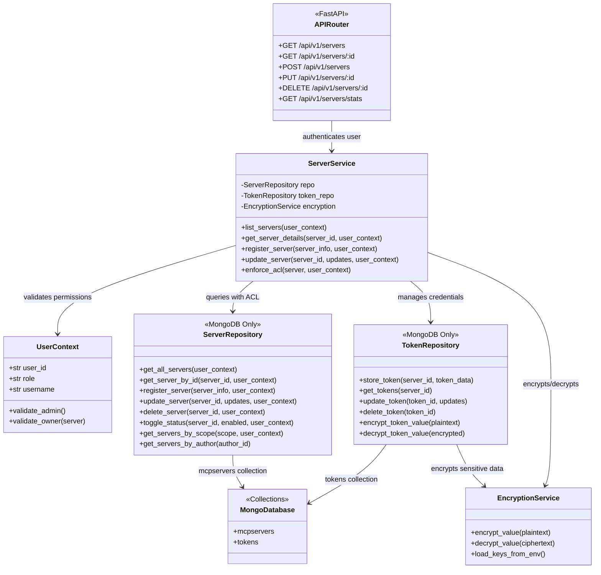

# MCP Gateway MongoDB Integration

Living design document for MongoDB integration

## Table of Contents
- [Introduction](#introduction)
    - [Problem statement](#problem-statement)
    - [Objectives](#objectives)
- [Proposed Architecture](#proposed-architecture)
- [MongoDB Integration](#mongodb-integration)
- [Additional Considerations](#additional-considerations)
    - [Shared Schema with jarvis-api](#shared-schema-with-jarvis-api)
        - [1. Database Naming Convention](#1-database-naming-convention)
        - [2. Schema Versioning](#2-schema-versioning)
        - [3. Migration Coordination](#3-migration-coordination)
        - [4. Cross-Application References](#4-cross-application-references)
    - [3. Structured Logging](#3-structured-logging)

## Introduction

### Problem Statement

The MCP Gateway Registry requires a robust persistence layer to establish foundational **Access Control List (ACL)** capabilities and **authentication management** for MCP servers. Currently, server configurations are stored as file-based JSON documents, which lack the necessary infrastructure for:

- **Fine-grained ACL control**: Managing server access across users, groups, and scopes (private, shared)
- **Authentication lifecycle**: Storing and managing OAuth tokens, API keys, and credentials
- **Multi-user environments**: Supporting concurrent access, role-based permissions (admin vs. regular users)
- **Transactional integrity**: Ensuring atomic updates for server configurations and associated credentials

### Migration Strategy

**Phase 1: One-time Import (Current)**
- Load existing file-based server configurations from `registry/server/*.json`
- Import servers into MongoDB during initial deployment
- This is a **one-way migration** - no backward compatibility with file-based storage

**Phase 2: MongoDB-Only Operation**
- All file-based storage code will be removed
- MongoDB becomes the single source of truth for:
  - Server configurations (mcpservers collection)
  - Authentication tokens (tokens collection)
  - User permissions and ACL metadata

### Objectives

- **Primary**: Establish MongoDB as the persistent storage layer for ACL-controlled MCP servers
- **Authentication Management**: Store and manage OAuth tokens, API keys, and client secrets with encryption
- **Role-Based Access Control**: Implement admin and user scopes with fine-grained permissions
- **Migration**: Import existing file-based servers once, then fully transition to MongoDB
- **No Backward Compatibility**: File-based storage will be removed after migration


## Proposed Architecture

**Core Design Principles:**
- **MongoDB-Only Storage**: Single source of truth for all server configurations and credentials
- **ACL-First Design**: Every server has scope (private_user, shared_user, shared_app) and author tracking
- **Authentication Management**: Encrypted storage for OAuth tokens, API keys, and client secrets
- **Role-Based Access Control**: Admin users see all servers, regular users see only authorized servers

**Configuration:**
- `MONGO_URI` (required): MongoDB connection string (env var via `config.py`)
- `CREDS_KEY` (required): AES-256 encryption key for sensitive credentials
- `CREDS_IV` (required): Initialization vector for AES-CBC encryption

### Architecture Diagram



**Component Responsibilities:**

- **APIRouter** (`registry/api/server_routes.py`): HTTP endpoints with JWT authentication, extracts `UserContext` from tokens
- **ServerService** (`registry/services/server_service.py`): Business logic, ACL enforcement, coordinates repositories
- **Models** (`packages/models/**`): MongoDB operations for mcp servers and tokens
- **EncryptionService** (`packages/database/encryption.py`): AES-CBC encryption/decryption for credentials
- **UserContext** (`registry/auth/dependencies.py`): Role-based access control, admin validation

### Data Schema

### Authorization

Permissions checks are contained within the server API router. It uses RBAC helpers found in `registry/auth/dependencies.py`


### API Endpoints

Endpoints should support the following operations:
- Admin can add/update/remove server configuration for all of the users
- Admin can add/update/remove server configuration for different groups
- User can add/update/remove their private server configuration

**ID Usage Convention:**
- **URL path parameter**: `{server_id}` (e.g., `/api/v1/servers/{server_id}`) - uses MongoDB ObjectId
- **Response body field**: `"id"` - returns the MongoDB ObjectId as a string
- **No separate `server_id` field**: We use only `id` to avoid redundancy and follow REST conventions
- **File-based compatibility**: When using file-based storage, `id` will be a generated UUID or hash of the `path` field
  * MongoDB: `"id": "674e1a2b3c4d5e6f7a8b9c0d"` (24-char ObjectId)
  * File-based: `"id": "uuid-v4-here"` or derived from path

**Server Response Schema:**

All server endpoints return a **flattened response structure** for frontend convenience. The API layer transforms the nested MongoDB `config` object into a flat structure.

⚠️ **IMPORTANT FOR ENGINEERS:**
```python
# Storage Layer (MongoDB): Nested config object for api key
{
  "_id": ObjectId("..."),
  "serverName": "github",
  "config": {  # ← Nested in database
    "title": "GitHub MCP Server",
    "description": "...",
    "type": "streamable-http",
    "url": "http://github-server:8011",  # ← Server endpoint URL
    "apiKey": {
      "source": "admin", #user or admin
      "authorization_type": "custom", # "bearer" "basic" AuthorizationTypeEnum
      "custom_header": "tavilyApiKey",
      "key": "xxxxxxxxx"
    },
    "requiresOAuth": false,
    "capabilities": "{\"experimental\":{},\"prompts\":{\"listChanged\":true},\"resources\":{\"subscribe\":false,\"listChanged\":true},\"tools\":{\"listChanged\":true}}",
    "toolFunctions": {
      "tavily_search_mcp_tavilysearchv1": {
        "type": "function",
        "function": {
          "name": "tavily_search_mcp_tavilysearchv1",
          "description": "xxxx",
          "parameters": {...},
          "required": [
              "query"
          ],
        ....
        }
      },
    "tools": "tavily_search, tavily_extract, tavily_crawl, tavily_map",
    "initDuration": 170
    }

  },
  "scope": "shared_app",  # ← Root level
  "status": "active",  # ← Root level
  "path": "/mcp/github",  # ← Root level
  "tags": ["github"],  # ← Root level
  "author": ObjectId("..."),
  "createdAt": ISODate("..."),
  "updatedAt": ISODate("...")
}

# Storage Layer (MongoDB): Nested config object for oauth
{
  "_id": ObjectId("..."),
  "serverName": "github",
  "config": {
    "title": "githubcopliot",
    "description": "copliot",
    "oauth": {
      "authorization_url": "https://github.com/login/oauth/authorize",
      "token_url": "https://github.com/login/oauth/access_token",
      "client_id": "Iv23lidC6dSy1q3Yr2sI",
      "client_secret": "xxxxxxxxxxxx",
      "scope": "repo user read:org"
    },
    "type": "streamable-http",
    "url": "https://api.githubcopilot.com/mcp/",
    "requiresOAuth": true,
    "oauthMetadata": { #it's the data from autodiscovery
      "resource": "https://api.githubcopilot.com/mcp",
      "authorization_servers": [
        "https://github.com/login/oauth"
      ],
      "scopes_supported": [
        "gist",
        "notifications",
        "public_repo",
        "repo",
        "repo:status",
        "repo_deployment",
        "user",
        "user:email",
        "user:follow",
        "read:gpg_key",
        "read:org",
        "project"
      ],
      "bearer_methods_supported": [
        "header"
      ],
      "resource_name": "GitHub MCP Server"
    },
    "capabilities": "{\"experimental\":{},\"prompts\":{\"listChanged\":true},\"resources\":{\"subscribe\":false,\"listChanged\":true},\"tools\":{\"listChanged\":true}}",
    "toolFunctions": {
      "tavily_search_mcp_tavilysearchv1": {
        "type": "function",
        "function": {
          "name": "tavily_search_mcp_tavilysearchv1",
          "description": "xxxx",
          "parameters": {...},
          "required": [
              "query"
          ],
        ....
        }
      },
    "tools": "tavily_search, tavily_extract, tavily_crawl, tavily_map",
    "initDuration": 49
  },
  "scope": "shared_app",  # ← Root level
  "status": "active",  # ← Root level
  "path": "/mcp/github",  # ← Root level
  "tags": ["github"],  # ← Root level
  "author": ObjectId("..."),
  "createdAt": ISODate("..."),
  "updatedAt": ISODate("...")
}

# API Response Layer: Flattened for frontend
{
  "id": "674e1a2b3c4d5e6f7a8b9c0d",
  "serverName": "github",
  # ↓ Config fields flattened from config object to root level
  "title": "GitHub MCP Server",
  "description": "...",
  "type": "sse",
  "url": "http://github-server:8011",  # ← From config.url
  "apiKey": {...},  # ← From config.apiKey (if present)
  "requiresOAuth": false,  # ← From config.requiresOAuth
  # ↓ Fields stored at root level in DB
  "author": "507f1f77bcf86cd799439011",
  "scope": "shared_app",
  "status": "active",
  "path": "/mcp/github",
  "tags": ["github"],
  "capabilities": "{...}",
  "tools": "tool1, tool2, tool3",
  # ↓ Computed fields
  "numTools": 3,  # ← Calculated from tools string split
  "numStars": 1250,  # ← From root in DB
  "lastConnected": "2026-01-04T14:30:00Z",  # ← From root in DB
  "createdAt": "2026-01-01T10:00:00Z",
  "updatedAt": "2026-01-03T15:45:00Z"
}

```


**Flattened API Response Fields:**

**Identity & Metadata:**
- `id`: string - MongoDB ObjectId converted to string
- `serverName`: string - Unique server identifier
- `author`: string - ObjectId of the user who created this server (as string)
- `scope`: string - Access level (shared_app, shared_user, private_user) *[stored at root in DB]*
- `status`: string - Server status (active, inactive, error) *[stored at root in DB]*
- `createdAt`: string (ISO 8601) - Creation timestamp
- `updatedAt`: string (ISO 8601) - Last update timestamp

**Configuration Fields (flattened from config object):**
- `title`: string - Display name
- `description`: string - Server description
- `type`: string - Transport type **ONLY: `streamable-http` or `sse`** (stdio/websocket not supported in registry)
- `url`: string - Server endpoint URL (required for HTTP-based transports)
- `apiKey`: object (optional) - API key configuration with `key`, `source`, `authorization_type`, `custom_header`
- `requiresOAuth`: boolean - Whether OAuth is required
- `oauth`: object (optional) - OAuth configuration
- `capabilities`: string - JSON string of server capabilities
- `tools`: string - Comma-separated list of tool names (e.g., "tool1, tool2, tool3")
- `toolFunctions`: object - Tool function definitions in OpenAI format *[NOT returned in list endpoints, only in detail/tools endpoints]*
- `initDuration`: number - Server initialization time in ms

**Additional Fields (stored at root or computed):**
- `path`: string - API path for this server (e.g., "/mcp/github") *[stored at root in DB]*
- `tags`: string[] - Array of tags for categorization *[stored at root in DB]*
- `numTools`: number - **Calculated** from splitting the `tools` string (e.g., "tool1, tool2" → 2)
- `numStars`: number - Number of stars/favorites *[stored at root in DB]*
- `lastConnected`: string (nullable, ISO 8601) - Last successful connection timestamp *[stored at root in DB]*
- `lastError`: string (nullable, ISO 8601) - Last error timestamp *[stored at root in DB]*
- `errorMessage`: string (nullable) - Last error message details *[stored at root in DB]*

**Reference:**
- Database schema: [mcpServer.py](../packages/models/_generated/mcpServer.py)
- Config schema (TypeScript): https://github.com/ascending-llc/jarvis-api/blob/e15d37b399fc186376843d77e8519545a7ead586/packages/data-provider/src/mcp.ts
- Retrieval logic: https://github.com/ascending-llc/jarvis-api/blob/e15d37b399fc186376843d77e8519545a7ead586/packages/api/src/mcp/registry/db/ServerConfigsDB.ts

#### Server Management Endpoints

**1. List Servers**
```http
GET /api/v1/servers?query={search_term}&scope={scope}&status={status}&page={page}&per_page={per_page}
Authorization: Bearer <token>

Query Parameters:
- query (optional): Free-text search across server_name, description, tags
  * Example: query=github searches all text fields
  * Uses MongoDB text index or regex matching

- scope (optional): Exact filter by access level
  * Values: shared_app, shared_user, private_user
  * Example: scope=private_user shows only user's private servers

- status (optional): Exact filter by operational state
  * Values: active, inactive, error
  * Example: status=active shows only enabled servers

- page (optional): Page number for pagination (default: 1, min: 1)
- per_page (optional): Items per page (default: 20, min: 1, max: 100)

Response 200:
{
  "servers": [
    {
      "id": "674e1a2b3c4d5e6f7a8b9c0d",
      "serverName": "github-copilot",
      "title": "GitHub Integration", #this is coming for config.title
      "description": "GitHub repository management and code search",
      "type": "streamable-http",
      "url": "http://github-server:8011",
      "requiresOAuth": true,
      "oauth": {
        "authorization_url": "https://github.com/login/oauth/authorize",
        "token_url": "https://github.com/login/oauth/access_token",
        "client_id": "Iv23li8dSy1q3r2sI",
        "client_secret": "***",
        "scope": "repo read:user read:org"
      },
      "capabilities": "{\"experimental\":{},\"prompts\":{\"listChanged\":true},\"resources\":{\"subscribe\":false,\"listChanged\":true},\"tools\":{\"listChanged\":true}}",
      "tools": "search_code, create_issue, list_repos, get_pull_requests",
      "author": "507f1f77bcf86cd799439011",
      "scope": "shared_app",
      "status": "active",
      "path": "/mcp/github",
      "tags": ["github", "version-control", "collaboration", "development"],
      "numTools": 4,
      "numStars": 1250,
      "initDuration": 49,
      "lastConnected": "2026-01-03T15:54:22.728+00:00",
      "createdAt": "2026-01-01T10:00:00Z",
      "updatedAt": "2026-01-03T15:45:00Z"
    },
    {
      "id": "674e1a2b3c4d5e6f7a8b9c0e",
      "serverName": "tavilysearchv1",
      "title": "Tavily Search v1",
      "description": "Search the web with Tavily",
      "type": "streamable-http",
      "url": "https://mcp.tavily.com/mcp/",
      "apiKey": {
        "key": "encrypted_api_key_here",
        "source": "admin",
        "authorization_type": "custom",
        "custom_header": "tavilyApiKey"
      },
      "requiresOAuth": false,
      "capabilities": "{\"experimental\":{},\"prompts\":{\"listChanged\":true},\"resources\":{\"subscribe\":false,\"listChanged\":true},\"tools\":{\"listChanged\":true}}",
      "tools": "tavily_search, tavily_extract, tavily_crawl, tavily_map",
      "author": "507f1f77bcf86cd799439011",
      "scope": "shared_app",
      "status": "active",
      "path": "/mcp/tavilysearchv1",
      "tags": ["search", "web", "tavily"],
      "numTools": 4,
      "numStars": 890,
      "lastConnected": "2026-01-04T15:09:45Z",
      "createdAt": "2026-01-04T15:09:45Z",
      "updatedAt": "2026-01-04T15:09:45Z"
    }
  ],
  "pagination": {
    "total": 42,
    "page": 1,
    "per_page": 20,
    "total_pages": 3
  }
}

**Note:** List endpoint does NOT return `toolFunctions` for performance.
```

**2. Get Server Details**
```http
GET /api/v1/servers/{server_id}
Authorization: Bearer <token>

Response 200:
{
  "id": "674e1a2b3c4d5e6f7a8b9c0d",
  "serverName": "github-copilot",
  "title": "GitHub Integration",
  "description": "GitHub repository management and code search",
  "type": "streamable-http",
  "url": "http://github-server:8011",
  "requiresOAuth": true,
  "oauth": {
    "authorization_url": "https://github.com/login/oauth/authorize",
    "token_url": "https://github.com/login/oauth/access_token",
    "authorize_url": "https://github.com/login/oauth/authorize",
    "client_id": "Iv23li8dSy1q3r2sI",
    "client_secret": "***",
    "scope": "repo read:user read:org"
  },
  "oauthMetadata": {
    "resource": "https://api.githubcopilot.com/mcp",
    "authorization_servers": ["https://github.com/login/oauth"],
    "scopes_supported": ["repo", "user", "read:org", "gist", "notifications"],
    "bearer_methods_supported": ["header"],
    "resource_name": "GitHub MCP Server"
  },
  "capabilities": "{\"experimental\":{},\"prompts\":{\"listChanged\":true},\"resources\":{\"subscribe\":false,\"listChanged\":true},\"tools\":{\"listChanged\":true}}",
  "tools": "search_code, create_issue, list_repos, get_pull_requests",
  "toolFunctions": {
    "search_code_mcp_github_copilot": {
      "type": "function",
      "function": {
        "name": "search_code_mcp_github_copilot",
        "description": "Search for code across GitHub repositories",
        "parameters": {
          "type": "object",
          "properties": {
            "query": {
              "type": "string",
              "description": "The search query"
            },
            "language": {
              "type": "string",
              "description": "Filter by programming language"
            }
          },
          "required": ["query"]
        }
      }
    },
    "create_issue_mcp_github_copilot": {
      "type": "function",
      "function": {
        "name": "create_issue_mcp_github_copilot",
        "description": "Create a new issue in a repository",
        "parameters": {
          "type": "object",
          "properties": {
            "owner": {"type": "string", "description": "Repository owner"},
            "repo": {"type": "string", "description": "Repository name"},
            "title": {"type": "string", "description": "Issue title"},
            "body": {"type": "string", "description": "Issue body"}
          },
          "required": ["owner", "repo", "title"]
        }
      }
    }
  },
  "initDuration": 150,
  "author": "507f1f77bcf86cd799439011",
  "scope": "shared_app",
  "status": "active",
  "path": "/mcp/github-copilot",
  "tags": ["github", "version-control"],
  "numTools": 4,
  "numStars": 1250,
  "lastConnected": "2026-01-03T15:54:22.728+00:00",
  "lastError": null,
  "errorMessage": null,
  "createdAt": "2026-01-01T10:00:00Z",
  "updatedAt": "2026-01-03T15:45:00Z"
}

**Note:** Detail endpoint includes `toolFunctions` with complete OpenAI function schemas.
```

**3. Register Server**
```http
POST /api/v1/servers
Authorization: Bearer <token>
Content-Type: application/json

Request:
{
  "serverName": "custom-api-server",
  "title": "Custom API Server",
  "description": "Internal API integration server",
  "type": "streamable-http",
  "url": "http://api-server:8080/mcp",
  "apiKey": {
    "key": "sk-123456",
    "source": "user",
    "authorization_type": "bearer"
  },
  "requiresOAuth": false,
  "scope": "private_user",
  "tags": ["api", "custom"]
}

Response 201:
{
  "id": "674e1a2b3c4d5e6f7a8b9c0e",
  "serverName": "custom-api-server",
  "title": "Custom API Server",
  "description": "Internal API integration server",
  "type": "streamable-http",
  "url": "http://api-server:8080/mcp",
  "apiKey": {
    "key": "***",
    "source": "user",
    "authorization_type": "bearer"
  },
  "requiresOAuth": false,
  "capabilities": "{\"tools\":{\"listChanged\":true}}",
  "tools": "fetch_data, post_data, get_status",
  "toolFunctions": {
    "search_custom_api_server": {
      "type": "function",
      "function": {
        "name": "fetch_data_mcp_custom_api_server",
        "description": "Fetch data from the API",
        "parameters": {
          "type": "object",
          "properties": {
            "endpoint": {"type": "string", "description": "API endpoint path"},
            "params": {"type": "object", "description": "Query parameters"}
          },
          "required": ["endpoint"]
        }
      }
    },
    "analyze_custom_api_server": {
      "type": "function",
      "function": {
        "name": "post_data_mcp_custom_api_server",
        "description": "Post data to the API",
        "parameters": {
          "type": "object",
          "properties": {
            "endpoint": {"type": "string"},
            "data": {"type": "object"}
          },
          "required": ["endpoint", "data"]
        }
      }
    }
  },
  "initDuration": 80,
  "author": "507f1f77bcf86cd799439012",
  "scope": "private_user",
  "status": "active",
  "path": "/mcp/custom-api-server",
  "tags": ["api", "custom"],
  "numTools": 3,
  "numStars": 0,
  "lastConnected": "2026-01-04T16:00:00Z",
  "createdAt": "2026-01-04T16:00:00Z",
  "updatedAt": "2026-01-04T16:00:00Z"
}

**Note:** Upon registration, the registry automatically:
1. Connects to the MCP server at the provided URL
2. Retrieves the server's capabilities and tool list
3. Stores `capabilities`, `tools` (comma-separated string), and `toolFunctions` (OpenAI format)
4. Calculates `numTools` from the tools string
5. Measures `initDuration` (connection time in ms)
```

**4. Update Server**
```http
PATCH /api/v1/servers/{server_id}
Authorization: Bearer <token>
Content-Type: application/json

Request:
{
  "description": "Updated - Enhanced GitHub integration with new features",
  "tags": ["github", "version-control", "collaboration"],
  "status": "active"
}

Response 200:
{
  "id": "674e1a2b3c4d5e6f7a8b9c0d",
  "serverName": "github",
  "title": "GitHub MCP Server",
  "description": "Updated description - Enhanced GitHub integration",
  "type": "streamable-http",
  "url": "http://github-server:8011",
  "requiresOAuth": true,
  "oauth": {
    "authorization_url": "https://github.com/login/oauth/authorize",
    "token_url": "https://github.com/login/oauth/access_token",
    "client_id": "Iv23li8dSy1q3r2sI",
    "client_secret": "***",
    "scope": "repo read:user read:org"
  },
  "capabilities": "{\"experimental\":{},\"prompts\":{\"listChanged\":true},\"resources\":{\"subscribe\":false,\"listChanged\":true},\"tools\":{\"listChanged\":true}}",
  "tools": "search_code, create_issue, list_repos, get_pull_requests",
  "initDuration": 49,
  "author": "69593baec59bdd2853ad0ff1",
  "scope": "shared_app",
  "status": "active",
  "path": "/mcp/github-copilot",
  "tags": ["github", "version-control", "collaboration"],
  "numTools": 4,
  "numStars": 1250,
  "lastConnected": "2026-01-04T14:30:00Z",
  "createdAt": "2026-01-01T10:00:00Z",
  "updatedAt": "2026-01-04T16:05:00Z"
}

Response 409 (Conflict):
{
  "error": "conflict",
  "message": "Server was modified by another process",
  "current_updated_at": "2026-01-04T16:05:00Z",
  "provided_updated_at": "2026-01-03T15:45:00Z"
}
```

**5. Delete Server**
```http
DELETE /api/v1/servers/{server_id}
Authorization: Bearer <token>

Response 204: No Content

Response 403:
{
  "error": "forbidden",
  "message": "Cannot delete another user's private server"
}

Response 404:
{
  "error": "not_found",
  "message": "Server not found"
}
```

**6. Toggle Server Status**
```http
POST /api/v1/servers/{server_id}/toggle
Authorization: Bearer <token>
Content-Type: application/json

Request:
{
  "enabled": true
}

Response 200:
{
  "id": "674e1a2b3c4d5e6f7a8b9c0d",
  "serverName": "github",
  "status": "active",
  "enabled": true,
  "message": "Server enabled successfully",
  "updatedAt": "2026-01-04T16:10:00Z"
}
```

**7. Get Server Tools**
```http
GET /api/v1/servers/{server_id}/tools
Authorization: Bearer <token>

Response 200:
{
  "id": "674e1a2b3c4d5e6f7a8b9c0d",
  "serverName": "github",
  "tools": [
    {
      "name": "search_code",
      "description": "Search for code across GitHub repositories",
      "inputSchema": {
        "type": "object",
        "properties": {
          "query": {
            "type": "string",
            "description": "Repository name"
          },
          "language": {
            "type": "string",
            "description": "Filter by programming language"
          }
        },
        "required": ["name"]
      }
    },
    {
      "name": "create_issue_github",
      "description": "Create a new issue in a repository",
      "inputSchema": {
        "type": "object",
        "properties": {
          "owner": {"type": "string", "description": "Repository owner"},
          "repo": {"type": "string", "description": "Repository name"},
          "title": {"type": "string", "description": "Issue title"},
          "body": {"type": "string", "description": "Issue body"}
        },
        "required": ["owner", "repo", "title"]
      }
    }
  ],
  "numTools": 4,
  "capabilities": {
    "experimental": {},
    "prompts": {"listChanged": true},
    "resources": {"subscribe": false, "listChanged": true},
    "tools": {"listChanged": true}
  },
  "cached": false,
  "retrievedAt": "2026-01-04T16:15:00Z"
}

**Note:** This endpoint returns tools in MCP's native format (with `inputSchema`), which is different from the `toolFunctions` OpenAI format stored in the database.
```

**8. Refresh Server Health**
```http
POST /api/v1/servers/{server_id}/refresh
Authorization: Bearer <token>

Response 200:
{
  "id": "674e1a2b3c4d5e6f7a8b9c0d",
  "serverName": "github",
  "status": "active",
  "lastConnected": "2026-01-04T16:20:00Z",
  "lastError": null,
  "errorMessage": null,
  "numTools": 4,
  "capabilities": "{\"experimental\":{},\"prompts\":{\"listChanged\":true},\"resources\":{\"subscribe\":false,\"listChanged\":true}}",
  "tools": "tavily_search, tavily_extract, tavily_crawl, tavily_map",
  "initDuration": 168,
  "message": "Server health check successful",
  "updatedAt": "2026-01-04T16:20:00Z"
}

**Note:** Health refresh reconnects to the MCP server and updates tools/capabilities if they changed.
```

#### Token Management Endpoints

**1. Store OAuth Token**
```http
POST /api/v1/tokens
Authorization: Bearer <token>
Content-Type: application/json

Request:
{
  "type": "oauth_access",
  "identifier": "github_mcp_server",
  "token": "gho_xxxxxxxxxxxxxxxxxxxx",
  "expires_at": "2024-12-15T18:00:00Z",
  "metadata": {
    "server_id": "674e1a2b3c4d5e6f7a8b9c0d",
    "server_name": "github_server",
    "scope": "repo read:user",
    "refresh_token_id": "674e1a2b3c4d5e6f7a8b9c11"
  }
}

Response 201:
{
  "id": "674e1a2b3c4d5e6f7a8b9c10",
  "type": "oauth_access",
  "identifier": "github_mcp_server",
  "created_at": "2024-12-15T10:00:00Z",
  "expires_at": "2024-12-15T18:00:00Z"
}
```

**2. Get Token**
```http
GET /api/v1/tokens/{token_id}
Authorization: Bearer <token>

Response 200:
{
  "id": "674e1a2b3c4d5e6f7a8b9c10",
  "user_id": "674e1a2b3c4d5e6f7a8b9c01",
  "type": "oauth_access",
  "identifier": "github_mcp_server",
  "token": "gho_xxxxxxxxxxxxxxxxxxxx",
  "created_at": "2024-12-15T10:00:00Z",
  "expires_at": "2024-12-15T18:00:00Z",
  "metadata": {
    "server_id": "674e1a2b3c4d5e6f7a8b9c0d",
    "server_name": "github_server",
    "scope": "repo read:user"
  }
}

Response 404:
{
  "error": "not_found",
  "message": "Token not found or expired"
}
```

**3. List User Tokens**
```http
GET /api/v1/tokens?type={type}&identifier={identifier}&page={page}&per_page={per_page}
Authorization: Bearer <token>

Query Parameters:
- type (optional): Filter by token type (oauth_access, oauth_refresh, api_key)
- identifier (optional): Filter by identifier
- page (optional): Page number for pagination (default: 1, min: 1)
- per_page (optional): Items per page (default: 50, min: 1, max: 100)

Response 200:
{
  "tokens": [
    {
      "id": "674e1a2b3c4d5e6f7a8b9c10",
      "type": "oauth_access",
      "identifier": "github_mcp_server",
      "created_at": "2024-12-15T10:00:00Z",
      "expires_at": "2024-12-15T18:00:00Z",
      "metadata": {
        "server_name": "github_server"
      }
    }
  ],
  "pagination": {
    "total": 23,
    "page": 1,
    "per_page": 50,
    "total_pages": 1
  }
}
```

**4. Refresh OAuth Token**
```http
PUT /api/v1/tokens/{token_id}/refresh
Authorization: Bearer <token>
Content-Type: application/json

Request:
{
  "new_access_token": "gho_newtoken",
  "new_expires_at": "2024-12-15T19:00:00Z",
  "new_refresh_token": "ghr_newrefresh"
}

Response 200:
{
  "id": "674e1a2b3c4d5e6f7a8b9c10",
  "type": "oauth_access",
  "identifier": "github_mcp_server",
  "token": "gho_newtoken",
  "expires_at": "2024-12-15T19:00:00Z",
  "updated_at": "2024-12-15T11:00:00Z"
}
```

**5. Delete Token**
```http
DELETE /api/v1/tokens/{token_id}
Authorization: Bearer <token>

Response 204: No Content

Response 404:
{
  "error": "not_found",
  "message": "Token not found"
}
```

**6. Generate JWT Token**
```http
POST /api/v1/tokens/generate
Authorization: Bearer <token>
Content-Type: application/json

Request:
{
  "requested_scopes": ["read:servers", "write:servers"],
  "expires_in_hours": 8,
  "description": "Token for automation"
}

Response 200:
{
  "success": true,
  "tokens": {
    "access_token": "eyJhbGciOiJSUzI1NiIsInR5cCI6IkpXVCJ9...",
    "refresh_token": "eyJhbGciOiJSUzI1NiIsInR5cCI6IkpXVCJ9...",
    "expires_in": 28800,
    "refresh_expires_in": 86400,
    "token_type": "Bearer",
    "scope": "read:servers write:servers"
  }
}
```

#### Admin Endpoints

**Admin Authorization:**
- Admins are identified by `user.role` from the `UserContext` (extracted from JWT token)
- Admin users have elevated permissions to manage all servers across the system

**Endpoint Behavior:**
- **Regular endpoints** (`/api/v1/servers`, `/api/v1/servers/{id}`, etc.) work for both regular users and admins
- **Regular users**: See only their own `private_user` servers + `shared_app` and `shared_user` servers they have access to
- **Admin users** (when `user.role == "admin"`): See ALL servers (`shared_app`, `shared_user`, and `private_user` from all users)

**Admin Capabilities:**
1. **List All Servers**: Use `GET /api/v1/servers` with admin token to see all servers system-wide
2. **Filter by User**: Add `?author={user_id}` to filter servers by specific user
3. **Create Shared Servers**: Admins can create servers with `scope: shared_app` or `scope: shared_user`
4. **Modify Any Server**: Admins can update/delete any server regardless of ownership
5. **View Statistics**: Access the dedicated stats endpoint for system-wide metrics

**Admin-Specific Endpoint:**

**GET /api/v1/servers/stats**
```http
GET /api/v1/servers/stats
Authorization: Bearer <admin_token>

Note: This endpoint uses MongoDB aggregation pipelines and is only available when using MongoDB storage backend.
File-based storage will return a simplified version or 501 Not Implemented.

Response 200:
{
  "total_servers": 250,
  "servers_by_scope": {
    "shared_app": 10,
    "shared_user": 40,
    "private_user": 200
  },
  "servers_by_status": {
    "active": 230,
    "inactive": 15,
    "error": 5
  },
  "servers_by_transport": {
    "streamable-http": 200,
    "sse": 50
  },
  "total_tokens": 450,
  "tokens_by_type": {
    "oauth_access": 200,
    "oauth_refresh": 200,
    "api_key": 50
  },
  "active_tokens": 380,
  "expired_tokens": 70,
  "active_users": 120,
  "total_tools": 3250
}
```

## MongoDB Integration

### Overview

MongoDB integration provides a scalable, multi-tenant storage backend for MCP server configurations and OAuth tokens, replacing the file-based JSON storage. This design enables sharing the database with other applications (e.g., jarvis-api) using a unified schema.

### Database Selection: Motor + Beanie ODM(TBD)

**Selected Stack:**
- **Motor**: Async MongoDB driver for Python (required for FastAPI async endpoints)
- **Beanie**: Async ODM built on Pydantic models (native FastAPI integration)

**Rationale:**
- Beanie provides type-safe models with automatic validation via Pydantic
- Seamless integration with FastAPI's dependency injection and request/response models
- Built-in support for async operations (critical for high-concurrency scenarios)
- Automatic index management and migration support
- Simpler than PyMongo for common CRUD operations while maintaining access to Motor when needed

### Data Models

#### Schema Generation Strategy

**Problem:** The MCP server schema is already defined in Jarvis's TypeScript packages (`@jarvis`/data-schemas`). Duplicating this schema in Python would create maintenance burden and drift.

**Solution:**
1. **Jarvis** publishes JSON schemas to GitHub Releases
2. **mcp-gateway-registry** downloads JSON schemas and generates Python locally
3. Generated Python code stored in `_generated/` (gitignored) - engineers run generation to browse schemas

**Architecture:**

```
┌─────────────────────────────────────────────────────────────┐
│ Jarvis Repository (ascending-llc/jarvis-api)                │
│ ─────────────────────────────────────────────────────────── │
│ packages/data-schemas/                                       │
│   ├── src/                                                   │
│   │   ├── types/                                             │
│   │   │   ├── mcp.ts           (TypeScript types)           │
│   │   │   └── token.ts         (TypeScript types)           │
│   │   └── schema/                                            │
│   │       ├── mcpServer.ts     (Mongoose schema)            │
│   │       └── token.ts         (Mongoose schema)            │
│   ├── scripts/                                               │
│   │   └── publish-schemas.sh   (Generate & publish JSON)    │
│   └── dist/                                                  │
│       └── json-schemas/                                      │
│           ├── MCPServerDocument.json  ← Published            │
│           ├── MCPOptions.json         ← Published            │
│           └── Token.json              ← Published            │
└─────────────────────────────────────────────────────────────┘
                          │
                          │ GitHub Release
                          │ https://github.com/.../releases/v0.0.31/
                          ↓
┌─────────────────────────────────────────────────────────────┐
│ mcp-gateway-registry Repository                             │
│ ─────────────────────────────────────────────────────────── │
│ scripts/                                                     │
│   └── generate_schemas.py     (Download & generate)         │
│                                                              │
│ packages/models/                                             │
│   ├── __init__.py             (Exports from _generated)     │
│   └── _generated/             (⚠️  .gitignored)             │
│       ├── README.md           (Generation instructions)     │
│       ├── .schema-version     (v0.0.31)                     │
│       ├── mcpserver.py        (Generated - NOT in git)      │
│       ├── mcpconfig.py        (Generated - NOT in git)      │
│       └── token.py            (Generated - NOT in git)      │
└─────────────────────────────────────────────────────────────┘
```

**Source of Truth:**
```
Jarvis (ascending-llc/jarvis-api)
└── packages/data-schemas/src/
    ├── types/
    │   ├── mcp.ts           # MCPServerDocument, MCPOptions types
    │   └── token.ts         # IToken type
    └── schema/
        ├── mcpServer.ts     # Mongoose schema for MCP servers
        └── token.ts         # Mongoose schema for tokens
```

**Published Artifacts (GitHub Releases):**
```
https://github.com/ascending-llc/jarvis-api/releases/download/v0.0.31/
├── MCPServerDocument.json
├── MCPOptions.json
└── Token.json
```

---

### Jarvis: Publishing JSON Schemas

**Build Script:** `packages/data-schemas/scripts/publish-schemas.sh`

```bash
#!/bin/bash
set -e

echo "🔍 Generating JSON schemas from TypeScript..."

# Ensure output directory exists
mkdir -p dist/json-schemas

# Generate JSON schema for MCPServerDocument
npx typescript-json-schema \
  --required \
  --strictNullChecks \
  --noExtraProps \
  --out dist/json-schemas/MCPServerDocument.json \
  src/types/mcp.ts MCPServerDocument

# Generate JSON schema for MCPOptions
npx typescript-json-schema \
  --required \
  --strictNullChecks \
  --noExtraProps \
  --out dist/json-schemas/MCPOptions.json \
  src/types/mcp.ts MCPOptions

# Generate JSON schema for Token
npx typescript-json-schema \
  --required \
  --strictNullChecks \
  --noExtraProps \
  --out dist/json-schemas/Token.json \
  src/types/token.ts IToken

# Add metadata to schemas
VERSION=$(node -p "require('./package.json').version")
TIMESTAMP=$(date -u +"%Y-%m-%dT%H:%M:%SZ")

for schema in dist/json-schemas/*.json; do
  # Add generation metadata
  jq ". + {\"x-generated\": {\"version\": \"$VERSION\", \"timestamp\": \"$TIMESTAMP\"}}" \
    "$schema" > "$schema.tmp" && mv "$schema.tmp" "$schema"
done

echo "✅ JSON schemas generated at dist/json-schemas/"
echo "   Version: $VERSION"
echo "   Timestamp: $TIMESTAMP"
```

**Package Configuration:** `packages/data-schemas/package.json`

```json
{
  "name": "@jarvis/data-schemas",
  "version": "0.0.31",
  "scripts": {
    "build": "npm run build:ts && npm run build:schemas",
    "build:ts": "rollup -c",
    "build:schemas": "bash scripts/publish-schemas.sh",
    "prepublishOnly": "npm run build:schemas"
  },
  "files": [
    "dist/json-schemas/*.json"
  ],
  "devDependencies": {
    "typescript-json-schema": "^0.65.0",
    "jq": "^1.7.0"
  }
}
```

**Published Schema URLs:**
```
https://github.com/ascending-llc/jarvis-api/releases/download/v0.0.31/MCPServerDocument.json
https://github.com/ascending-llc/jarvis-api/releases/download/v0.0.31/MCPOptions.json
https://github.com/ascending-llc/jarvis-api/releases/download/v0.0.31/Token.json
```

---

### mcp-gateway-registry: Generating Python Schemas Locally

**Key Design Decision:** Generated schemas are **NOT** committed to git. Engineers must run generation locally to browse schema definitions without switching repos.

**Generation Script:** `scripts/generate_schemas.py`

```python
#!/usr/bin/env python3
"""
Generate Python Beanie models from Jarvis JSON schemas.

Generated files are placed in packages/models/_generated/ (gitignored).
Engineers run this script to browse schemas in their IDE without repo switching.

Usage:
    python scripts/generate_schemas.py [--version VERSION]

Example:
    python scripts/generate_schemas.py --version v0.0.31
    python scripts/generate_schemas.py  # Uses version from .schema-version
"""

import argparse
import json
import subprocess
import sys
from pathlib import Path
from datetime import datetime
import urllib.request

# Configuration
JARVIS_REPO = "ascending-llc/jarvis-api"
SCHEMA_BASE_URL = f"https://github.com/{JARVIS_REPO}/releases/download"
OUTPUT_DIR = Path("packages/models/_generated")
SCHEMA_VERSION_FILE = OUTPUT_DIR / ".schema-version"

SCHEMAS = {
    "MCPServerDocument": "mcpserver.py",
    "MCPOptions": "mcpconfig.py",
    "Token": "token.py",
}


def download_schema(schema_name: str, version: str) -> dict:


def generate_python_model(schema_data: dict, output_file: Path):


def create_package_files(version: str):
```

**Make executable & add to pyproject.toml:**

```bash
chmod +x scripts/generate_schemas.py
```

```toml
[project.scripts]
generate-schemas = "scripts.generate_schemas:main"

[tool.poetry.dependencies]
datamodel-code-generator = "^0.25.0"  # For schema generation
```

**Usage:**

```bash
# Install dependencies
pip install datamodel-code-generator

# Generate from specific Jarvis version
python scripts/generate_schemas.py --version v0.0.31

# Generate using version from .schema-version file
python scripts/generate_schemas.py
```

**Generated Directory Structure (gitignored):**

```
packages/models/_generated/      # ⚠️  In .gitignore
├── .schema-version              # "v0.0.31"
├── README.md                    # DO NOT EDIT warning + instructions
├── __init__.py                  # Exports
├── mcpserver.py                 # ❌ NOT in git - generated locally
├── mcpconfig.py                 # ❌ NOT in git - generated locally
└── token.py                     # ❌ NOT in git - generated locally
```

**Using Generated Schemas:**

```python
# packages/models/__init__.py
from ._generated import MCPServer, MCPConfig, OAuthConfig, Token

__all__ = ["MCPServer", "MCPConfig", "OAuthConfig", "Token"]


# In application code - engineers must generate locally to browse
from packages.models import MCPServer, MCPConfig, Token

server = MCPServer(
    server_name="github",
    config=MCPConfig(
        title="GitHub",
        type="stdio",
        command="npx",
        args=["-y", "@modelcontextprotocol/server-github"]
    ),
    author=ObjectId(user_id)
)

token = Token(
    user_id=ObjectId(user_id),
    type="oauth_access",
    identifier="github_mcp_server",
    token="gho_xxxxxxxxxxxxxxxxxxxx",
    expires_at=datetime.now() + timedelta(hours=8)
)
```

**Benefits of Gitignored Approach:**
- ✅ No merge conflicts on generated code
- ✅ Clean git history (no schema noise)
- ✅ Engineers can still browse schemas in IDE (run generation locally)
- ✅ No repo switching needed to understand schema
- ✅ Jarvis publishes JSON once, each engineer generates when needed
- ⚠️  Engineers must run generation script before development

---

### Workflow Summary

**Jarvis Side:**
1. Update TypeScript schemas in `data-schemas/src/types/` and `data-schemas/src/schema/`
2. Run `npm run build:schemas` → generates JSON
3. Push tag `v0.0.32` → GitHub Action publishes JSON to Release
4. JSON schemas available at `https://github.com/ascending-llc/jarvis-api/releases/download/v0.0.32/*.json`

**mcp-gateway-registry Side:**
1. Run `python scripts/generate_schemas.py --version v0.0.32`
2. Script downloads JSON from GitHub Release
3. Generates Python Beanie models in `packages/models/_generated/`
4. Engineers can browse schema code in IDE
5. Generated files are NOT committed (gitignored)
6. Each engineer runs generation locally when needed

**Developer Experience:**
```python
# Engineers run generation locally first
$ python scripts/generate_schemas.py --version v0.0.31

# Then can browse schema in IDE
from packages.models import MCPServer  # Cmd+Click works!

# IDE shows (from generated file):
class MCPServer(Document):
    """MCP Server document (collection: mcpservers)"""
    server_name: str
    config: MCPConfig
    author: ObjectId
    # ... full schema visible
```

**Version Control Best Practices:**

```gitignore
# .gitignore
# Ignore generated schemas (engineers generate locally)
packages/models/_generated/
!packages/models/_generated/README.md  # Keep instructions in git
```

```bash
# First time setup for new engineers
$ python scripts/generate_schemas.py --version v0.0.31
✅ Generated in packages/models/_generated
💡 Schemas are gitignored - each engineer runs generation locally

# Verify schemas exist before running app
$ python -c "from packages.models import MCPServer; print('✅ Schemas ready')"
```


---

#### Design Decision: Connection State Management

> **❓ Question:** Should we update `status` and `connection_state` in MongoDB every time a user connects to an MCP server?
>
> **✅ Answer:** **NO** - This would create excessive database writes. Instead:
>
> 1. **`status`** (stored in MongoDB):
>    - User/admin controlled field (`active`, `inactive`, `error`)
>    - Only updated when user/admin changes it
>    - Persisted for configuration purposes
>
> 2. **`connection_state`** (stored in-memory, NOT MongoDB):
>    - Runtime state (`disconnected`, `connecting`, `connected`, `error`)
>    - **Stored in-memory only** (no MongoDB writes for state transitions)
>    - User-level state tracked in `MCPConnectionService.user_connections[user_id][server_name]`
>    - App-level state tracked in `MCPConnectionService.app_connections[server_name]`
>
>    **Connection Lookup Flow (when frontend requests status):**
>    1. **Check in-memory first**:
>       - App-level connections (for non-OAuth servers)
>       - User-level connections (for OAuth servers)
>    2. **If connected in-memory**: Return `connected` immediately
>    3. **If not in memory or stale**:
>       - Try existing access token → reconnect → store in memory
>       - If failed, try refresh token → reconnect → store in memory
>       - If both fail: Return `disconnected` (trigger OAuth or API key update)
>    4. **During OAuth flow**: Return `connecting` state (tracked by reconnection manager)
>
>    **State Resolution Priority** (matches jarvis pattern):
>    ```python
>    # 1. Base state from connection object
>    base_state = connection.connection_state if connection and not connection.is_stale() else 'disconnected'
>
>    # 2. OAuth-specific overrides (for OAuth servers only)
>    if base_state == 'disconnected' and is_oauth_server:
>        if reconnection_manager.is_reconnecting(user_id, server_name):
>            return 'connecting'
>        elif flow_state_manager.has_failed_flow(user_id, server_name):
>            return 'error'
>        elif flow_state_manager.has_active_flow(user_id, server_name):
>            return 'connecting'
>
>    # 3. Return final state
>    return base_state
>    ```
>
>    **Design Rationale:**
>    - ✅ Avoids excessive MongoDB writes (thousands per minute avoided)
>    - ✅ Fast lookups (in-memory dictionary access)
>    - ✅ User-level isolation (each user has independent connection state)
>    - ✅ Stale detection (reconnect if server config updated or connection idle)
>    - ✅ OAuth flow awareness (connecting/error states during OAuth)
> 3. **`last_connected`** (stored in MongoDB):
>    - Timestamp of last successful connection
>    - Updated **only on successful connections** (not on every state change)
>    - Used to determine if server was "recently active"
>
> **Database Update Strategy:**
> - ✅ Update MongoDB when: User enables/disables server, successful connection, errors occur
> - ❌ Don't update MongoDB when: Connecting, disconnecting, or normal state transitions
>
> This design avoids thousands of unnecessary database writes while still tracking meaningful events.

#### Generated Schema Structure

The generated Python schemas from Jarvis's TypeScript definitions will include:

**1. MCP Server Configuration Collection**

**Collection Name**: `mcpservers`

**Generated from**: `packages/data-schemas/src/types/mcp.ts` (TypeScript → JSON → Python)

**Key Models:**
- `MCPServer(Document)` - Main Beanie document model (from `MCPServerDocument`)
- `MCPConfig(BaseModel)` - Server configuration (from `MCPOptions`)
- `OAuthConfig(BaseModel)` - OAuth authentication settings
- `ApiKeyConfig(BaseModel)` - API key authentication settings
- `StdioTransport(BaseModel)` - Stdio transport configuration
- `WebSocketTransport(BaseModel)` - WebSocket transport configuration
- `SSETransport(BaseModel)` - Server-Sent Events transport configuration
- `StreamableHTTPTransport(BaseModel)` - HTTP transport configuration
- `CustomUserVar(BaseModel)` - User variable definition
- `StreamableHTTPTransport(BaseModel)` - HTTP transport configuration
- `CustomUserVar(BaseModel)` - User variable definition

**Schema Fields** (auto-generated to match TypeScript):
```python
class MCPServer(Document):
    """Generated from MCPServerDocument (TypeScript)"""

    server_name: Indexed(str)  # Maps to serverName
    config: MCPConfig          # Nested configuration
    author: Indexed(ObjectId)  # User who created this server

    # Timestamps (auto-managed)
    created_at: datetime       # Maps to createdAt
    updated_at: datetime       # Maps to updatedAt

    class Settings:
        name = "mcpservers"
        indexes = [
            [("serverName", 1)],
            [("author", 1)],
            [("updatedAt", -1), ("_id", 1)]
        ]
```

**Note:** The complete schema definition is generated automatically from TypeScript. Run `python scripts/generate_schemas.py` to generate and browse `packages/models/_generated/mcpserver.py`.

**2. Token Storage Collection**

**Collection Name**: `tokens`

**Generated from**: `packages/data-schemas/src/types/token.ts` (TypeScript → JSON → Python)

**Schema Definition** (auto-generated):

```python
class Token(Document):
    """Generated from IToken (TypeScript)"""

    user_id: Indexed(ObjectId)  # Reference to user (maps to userId)
    email: Optional[str] = None  # Optional email
    type: Optional[str] = None  # Token type (e.g., "oauth_access", "oauth_refresh")
    identifier: Optional[str] = None  # Token identifier/name
    token: str  # The actual token value (required) - encrypted at rest

    # Timestamps
    created_at: Indexed(datetime)  # Creation timestamp (maps to createdAt)
    expires_at: Indexed(datetime)  # Expiration timestamp (maps to expiresAt)

    # Flexible metadata storage
    metadata: Optional[Dict[str, Any]] = None  # Can store any data structure

    class Settings:
        name = "tokens"
        indexes = [
            [("userId", 1), ("type", 1)],  # Tokens by user and type
            [("userId", 1), ("identifier", 1)],  # Unique token per user/identifier
            [("expiresAt", 1)],  # TTL index for automatic cleanup
            [("type", 1), ("identifier", 1)],  # Quick lookups by type/identifier
        ]

    # TTL index configuration (MongoDB will auto-delete expired tokens)
    class Config:
        schema_extra = {
            "indexes": [
                {"keys": [("expiresAt", 1)], "expireAfterSeconds": 0}
            ]
        }
```

**Note:** Token schema is shared with Jarvis. Run `python scripts/generate_schemas.py` to generate and browse `packages/models/_generated/token.py`.

### Storage Examples

⚠️ **IMPORTANT:** In MongoDB, the `config` object remains **nested**. The flattening only happens at the API response layer.

#### Example 1: GitHub Server (streamable-http)

```json
{
  "_id": ObjectId("674e1a2b3c4d5e6f7a8b9c0d"),
  "serverName": "github",
  "config": {
    "title": "GitHub MCP Server",
    "description": "Interact with GitHub repositories, issues, and pull requests",
    "type": "streamable-http",
    "url": "https://mcp-github.example.com/",
    "requiresOAuth": false,
    "capabilities": "{\"experimental\":{},\"prompts\":{\"listChanged\":true},\"resources\":{\"subscribe\":false,\"listChanged\":true},\"tools\":{\"listChanged\":true}}",
    "tools": "create_repository, create_issue, search_repositories",
    "toolFunctions": {
      "create_repository_github": {
        "type": "function",
        "function": {
          "name": "create_repository_github",
          "description": "Create a new GitHub repository",
          "parameters": {
            "type": "object",
            "properties": {
              "name": {"type": "string", "description": "Repository name"},
              "private": {"type": "boolean", "description": "Whether the repository is private"}
            },
            "required": ["name"]
          }
        }
      }
    },
    "initDuration": 150
  },
  "author": ObjectId("507f1f77bcf86cd799439011"),
  "scope": "shared_app",
  "status": "active",
  "path": "/mcp/github",
  "tags": ["github", "version-control", "collaboration"],
  "numTools": 3,
  "numStars": 1250,
  "lastConnected": ISODate("2026-01-04T14:30:00Z"),
  "lastError": null,
  "errorMessage": null,
  "createdAt": ISODate("2026-01-01T10:00:00Z"),
  "updatedAt": ISODate("2026-01-03T15:45:00Z")
}
```

#### Example 2: Tavily Search Server (streamable-http with API key)

```json
{
  "_id": ObjectId("674e1a2b3c4d5e6f7a8b9c0e"),
  "serverName": "tavilysearchv1",
  "config": {
    "title": "tavilysearchv1",
    "description": "tavily search",
    "type": "streamable-http",
    "url": "https://mcp.tavily.com/mcp/",
    "apiKey": {
      "key": "51d082dd191f6dcf7dfdd60bc318f53e:5a052bb48fef0635329562541e62f6cc9e866d1c9303af4b36bae0ae3662eceac0265872b4e92b9469a459c44055091d",
      "source": "admin",
      "authorization_type": "custom",
      "custom_header": "tavilyApiKey"
    },
    "requiresOAuth": false,
    "capabilities": "{\"experimental\":{},\"prompts\":{\"listChanged\":true},\"resources\":{\"subscribe\":false,\"listChanged\":true},\"tools\":{\"listChanged\":true}}",
    "tools": "tavily_search, tavily_extract, tavily_crawl, tavily_map",
    "toolFunctions": {
      "tavily_search_mcp_temp_server_name": {
        "type": "function",
        "function": {
          "name": "tavily_search_mcp_temp_server_name",
          "description": "Search the web for real-time information about any topic...",
          "parameters": {
            "type": "object",
            "properties": {
              "query": {"description": "Search query", "type": "string"},
              "max_results": {"default": 5, "type": "integer"}
            },
            "required": ["query"]
          }
        }
      },
      "tavily_extract_mcp_temp_server_name": {
        "type": "function",
        "function": {
          "name": "tavily_extract_mcp_temp_server_name",
          "description": "Extract and process content from specific web pages...",
          "parameters": {
            "type": "object",
            "properties": {
              "urls": {"items": {"type": "string"}, "type": "array"}
            },
            "required": ["urls"]
          }
        }
      }
    },
    "initDuration": 119
  },
  "author": ObjectId("67efec288d159a51908dcf10"),
  "scope": "shared_app",
  "status": "active",
  "path": "/mcp/tavilysearchv1",
  "proxyPassUrl": "https://mcp.tavily.com",
  "tags": ["search", "web", "tavily"],
  "numTools": 4,
  "numStars": 0,
  "lastConnected": ISODate("2026-01-04T15:09:45Z"),
  "lastError": null,
  "errorMessage": null,
  "createdAt": ISODate("2026-01-04T15:09:45.754Z"),
  "updatedAt": ISODate("2026-01-04T15:09:45.754Z"),
  "__v": 0
}
```

#### Example 3: SSE Server with Error

```json
{
  "_id": ObjectId("674e1a2b3c4d5e6f7a8b9c0f"),
  "serverName": "custom-analytics",
  "config": {
    "title": "Custom Analytics",
    "description": "Private analytics integration",
    "type": "sse",
    "url": "https://analytics.example.com/events",
    "apiKey": {
      "key": "encrypted_key_here",
      "source": "user",
      "authorization_type": "bearer"
    },
    "requiresOAuth": false,
    "capabilities": "{\"tools\":{}}",
    "tools": "query_data, generate_report",
    "toolFunctions": {
      "query_data_custom_analytics": {
        "type": "function",
        "function": {
          "name": "query_data_custom_analytics",
          "description": "Query analytics data",
          "parameters": {"type": "object", "properties": {"query": {"type": "string"}}}
        }
      }
    },
    "initDuration": 200
  },
  "author": ObjectId("507f1f77bcf86cd799439012"),
  "scope": "private_user",
  "status": "error",
  "path": "/mcp/custom-analytics",
  "proxyPassUrl": "http://sse-proxy:8080",
  "tags": ["analytics", "custom"],
  "numTools": 2,
  "numStars": 0,
  "lastConnected": ISODate("2026-01-03T10:15:00Z"),
  "lastError": ISODate("2026-01-04T08:30:00Z"),
  "errorMessage": "Connection timeout: Could not connect to https://analytics.example.com/events after 3 attempts",
  "createdAt": ISODate("2026-01-02T14:20:00Z"),
  "updatedAt": ISODate("2026-01-04T08:30:00Z")
}
```

#### Example 4: OAuth Access Token Storage

```json
{
  "_id": ObjectId("674e1a2b3c4d5e6f7a8b9c10"),
  "user_id": ObjectId("user123"),
  "email": "user@example.com",
  "type": "oauth_access",
  "identifier": "github_mcp_server",
  "token": "gho_xxxxxxxxxxxxxxxxxxxx",
  "created_at": ISODate("2024-12-15T10:00:00.000Z"),
  "expires_at": ISODate("2024-12-15T18:00:00.000Z"),
  "metadata": {
    "server_name": "github_server",
    "token_type": "Bearer",
    "scope": "repo read:user",
    "refresh_token_id": ObjectId("674e1a2b3c4d5e6f7a8b9c11")
  }
}
```

#### Example 5: OAuth Refresh Token Storage

```json
{
  "_id": ObjectId("674e1a2b3c4d5e6f7a8b9c11"),
  "user_id": ObjectId("user123"),
  "email": "user@example.com",
  "type": "oauth_refresh",
  "identifier": "github_mcp_server_refresh",
  "token": "ghr_yyyyyyyyyyyyyyyy",
  "created_at": ISODate("2024-12-15T10:00:00.000Z"),
  "expires_at": ISODate("2024-06-15T10:00:00.000Z"),
  "metadata": {
    "server_name": "github_server",
    "access_token_id": ObjectId("674e1a2b3c4d5e6f7a8b9c10")
  }
}
}
```

### Repository Implementation

#### Connection State Management Strategy

**Key Principle: Minimize Database Writes**

Connection state changes happen frequently (every time a user opens/closes a connection), so we avoid persisting ephemeral state to MongoDB:

```python
# In-memory connection state tracking (using Redis or application cache)
class ConnectionStateCache:
    """Track real-time connection states without DB writes"""

    def __init__(self):
        self.cache = TTLCache(maxsize=1000, ttl=300)  # 5-minute TTL

    async def set_state(self, server_id: str, state: str):
        """Update in-memory state only"""
        self.cache[server_id] = {
            "state": state,
            "updated_at": datetime.utcnow()
        }

    async def get_state(self, server_id: str) -> str:
        """Get current connection state from cache"""
        cached = self.cache.get(server_id)
        return cached["state"] if cached else "disconnected"

# Only update MongoDB for meaningful events
async def handle_connection_event(server_id: ObjectId, event: str):
    """Handle connection events with selective persistence"""

    # Update in-memory state immediately
    await connection_cache.set_state(str(server_id), event)

    # Only persist to MongoDB for important events:
    if event == "connected":
        # Update last_connected timestamp
        await MCPServer.find_one(MCPServer.id == server_id).update({
            "$set": {
                "last_connected": datetime.utcnow(),
                "error_message": None,
                "last_error": None
            }
        })

    elif event == "error":
        # Record error information
        server = await MCPServer.get(server_id)
        await server.update({
            "$set": {
                "last_error": datetime.utcnow(),
                "error_message": "Connection failed",
                "status": "error"  # Only if repeated failures
            }
        })

    # Don't persist "connecting" or "disconnecting" states
```

**When to Update MongoDB:**
- ✅ **On successful connection**: Update `last_connected` timestamp
- ✅ **On error**: Update `last_error`, `error_message`, and possibly `status`
- ✅ **User action**: Update `status` when user enables/disables server
- ❌ **Don't update**: On "connecting", "disconnecting", or normal disconnect

**API Response Example:**
```python
async def get_server_with_state(server_id: ObjectId) -> dict:
    """Combine MongoDB data with real-time state"""

    # Get persisted data from MongoDB
    server = await MCPServer.get(server_id)

    # Get current connection state from cache
    current_state = await connection_cache.get_state(str(server_id))

    return {
        **server.dict(),
        "connection_state": current_state,  # Real-time state
        "is_recently_active": (
            server.last_connected and
            datetime.utcnow() - server.last_connected < timedelta(minutes=5)
        )
    }
```


### Encryption & Decryption for Sensitive Data

**Purpose**: Protect sensitive credentials stored in MongoDB using AES-CBC (Advanced Encryption Standard - Cipher Block Chaining).

**Configuration**:
- `process.env.CREDS_KEY` - Encryption key (32 bytes for AES-256)
- `process.env.CREDS_IV` - Initialization Vector (16 bytes)

**Fields to Encrypt**:
- OAuth access tokens and refresh tokens
- API keys
- OAuth client secrets

**Pseudocode**:

```python
# Encryption
def encrypt_value(plaintext: str) -> str:
    key = process.env.CREDS_KEY
    iv = process.env.CREDS_IV

    # Convert plaintext to bytes
    data = plaintext.encode('utf-8')

    # Encrypt using AES-CBC
    cipher = AES_CBC(key, iv)
    encrypted_bytes = cipher.encrypt(data)

    # Convert to hex string for storage
    return encrypted_bytes.hex()

# Decryption
def decrypt_value(encrypted_hex: str) -> str:
    key = process.env.CREDS_KEY
    iv = process.env.CREDS_IV

    # Convert hex string back to bytes
    encrypted_bytes = bytes.fromhex(encrypted_hex)

    # Decrypt using AES-CBC
    cipher = AES_CBC(key, iv)
    decrypted_bytes = cipher.decrypt(encrypted_bytes)

    # Convert bytes back to string
    return decrypted_bytes.decode('utf-8')

# Usage Example
# Before saving to database
token_value = encrypt_value("my-secret-token-12345")
client_secret = encrypt_value("oauth-client-secret-abc")

# After reading from database
plaintext_token = decrypt_value(token_value)
plaintext_secret = decrypt_value(client_secret)
```


### Seeding Initial Data

For initial deployment to customer environments, we seed the database with sample/default server configurations from JSON files. This is a **one-time operation** run by DevOps during deployment, not an automatic migration.


### Monitoring & Observability

#### 1. Database Metrics

- Track query performance using MongoDB slow query log
- Monitor connection pool utilization
- Alert on failed connections or high latency

#### 2. Token Lifecycle Metrics

- Count of active tokens per user
- Token refresh success/failure rates
- Expired token cleanup statistics

#### 3. Audit Logging

```python
class AuditLog(Document):
    """Audit trail for server configuration changes"""

    action: str  # "create", "update", "delete"
    entity_type: str  # "server", "token"
    entity_id: ObjectId
    user_id: ObjectId
    changes: Dict[str, Any]  # Before/after snapshot
    timestamp: datetime = Field(default_factory=datetime.utcnow)

    class Settings:
        name = "audit_logs"
```

## Additional Considerations

### Shared Schema with jarvis-api

Since both `mcp-gateway-registry` and `jarvis-api` share the same MongoDB instance, schema coordination is achieved through **code generation** from the Jarvis TypeScript source.

#### 1. Database Naming Convention

```
Database: jarvis (shared)
Collections:
  - mcpservers (shared schema - generated from Jarvis TypeScript)
  - tokens (mcp-gateway-registry specific)
  - users (managed by jarvis-api)
  - [other jarvis-api collections...]
```

#### 2. Schema Versioning and Synchronization

**TypeScript Source of Truth:**
```python
# Generated Python models include version metadata
class MCPServer(Document):
    class Config:
        json_schema_extra = {
            "source": "MCPServerDocument",
            "package": "@jarvis/data-schemas",
            "version": "0.0.31",  # Tracks Jarvis package version
            "generated_at": "2025-12-16T12:00:00Z"
        }
```

**Keeping Schemas in Sync:**

1. **Manual Regeneration**: Run `python scripts/generate_schemas.py --version v0.0.32` when Jarvis updates
2. **Version Tracking**: `.schema-version` file tracks current Jarvis version
3. **Version Validation**: Check schema version on application startup

```python
# registry/utils/schema_version.py
from pathlib import Path
from registry.models._generated import __version__ as schema_version

def check_schema_compatibility():
    """Verify schema version compatibility on startup"""
    expected_version = "v0.0.31"  # From config or environment

    if schema_version != expected_version:
        raise RuntimeError(
            f"Schema version mismatch! "
            f"Expected {expected_version}, got {schema_version}. "
            f"Run: python scripts/generate_schemas.py --version {expected_version}"
        )
```

#### 3. Schema Update Process

**When Jarvis Updates:**
1. Jarvis team pushes new tag (e.g., `v0.0.32`)
2. GitHub Actions publishes JSON schemas to Release
3. mcp-gateway-registry engineer runs generation script
4. Review generated code changes
5. Commit and deploy

**Manual Update Steps:**
```bash
# 1. Generate new schemas from Jarvis release
python scripts/generate_schemas.py --version v0.0.32

# 2. Review changes in generated files
git diff packages/models/_generated/

# 3. Run tests to ensure compatibility
pytest tests/

# 4. Commit generated code
git add packages/models/_generated/
git commit -m "chore: update schemas to Jarvis v0.0.32"

# 5. Deploy
git push
```

**No Database Migrations Needed:**
- Generated Python models are validated by Beanie on startup
- Both apps use the same `mcpservers` collection
- MongoDB's schema-less nature handles evolution gracefully
- Breaking changes would be caught by Pydantic validation at runtime

#### 4. Cross-Application References

```python
# Both applications share the same MCPServer schema (via generated code)
from registry.models import MCPServer

# mcp-gateway-registry can query servers created by Jarvis
async def get_user_available_servers(user_id: ObjectId):
    """Get all MCP servers available to user"""
    servers = await MCPServer.find({
        "author": user_id  # Field name matches Jarvis
    }).to_list()

    return servers

# Jarvis (jarvis-api) can query MCP servers for tool discovery
async def get_user_available_tools(user_id: ObjectId):
    """Get all tools available to user from MCP servers"""
    servers = await MCPServer.find({
        "author": user_id,
        "config.startup": True  # Auto-start servers
    }).to_list()

    # Extract tools from server configs
    all_tools = []
    for server in servers:
        if server.config.type == "stdio":
            # Parse tools from server
            tools = await discover_mcp_tools(server)
            all_tools.extend(tools)

    return all_tools
```

**Key Compatibility Points:**
- ✅ **Field Names**: `server_name`, `config`, `author` match exactly
- ✅ **Collection Name**: Both use `mcpservers`
- ✅ **Data Types**: ObjectId, datetime, nested objects are compatible
- ✅ **Indexes**: Generated schema includes Jarvis's index definitions
- ✅ **Validation**: Pydantic validation mirrors Zod validation rules
#### 3. Structured Logging

```python
import structlog

logger = structlog.get_logger()

async def register_server(server_info, user_id):
    logger.info(
        "server_registration_attempt",
        server_name=server_info["server_name"],
        user_id=str(user_id),
        scope=server_info["scope"]
    )

    try:
        server = await mongo_repo.register_server(server_info, user_id)

        logger.info(
            "server_registered",
            server_id=str(server.id),
            server_name=server.server_name,
            user_id=str(user_id)
        )

        mcp_server_operations.labels(
            operation="register",
            status="success"
        ).inc()

        return server

    except Exception as e:
        logger.error(
            "server_registration_failed",
            server_name=server_info["server_name"],
            error=str(e),
            user_id=str(user_id)
        )

        mcp_server_operations.labels(
            operation="register",
            status="error"
        ).inc()

        raise
```
