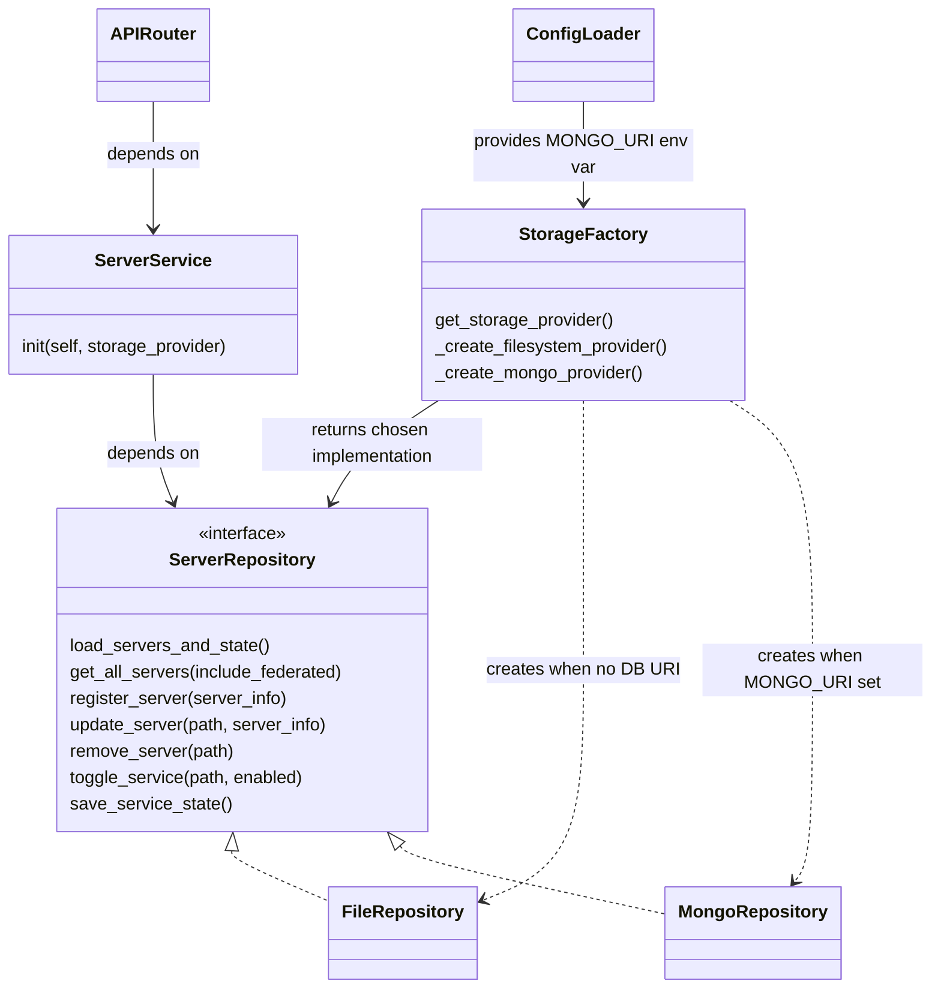

# MCP Gateway MongoDB Integration

Living design document for MongoDB integration

## Table of Contents
- [Introduction](#introduction)
    - [Problem statement](#problem-statement)
    - [Objectives](#objectives)
- [Proposed Architecture](#proposed-architecture)
- [MongoDB Integration](#mongodb-integration)
- [Additional Considerations](#additional-considerations)
    - [Shared Schema with jarvis-api](#shared-schema-with-jarvis-api)
        - [1. Database Naming Convention](#1-database-naming-convention)
        - [2. Schema Versioning](#2-schema-versioning)
        - [3. Migration Coordination](#3-migration-coordination)
        - [4. Cross-Application References](#4-cross-application-references)
    - [3. Structured Logging](#3-structured-logging)

## Introduction

### Problem statement

Server configuration data is currently persisted to the filesystem as JSON documents stored under `registry/server/*.json`. This approach has limitations for scale, concurrency, and transactional guarantees. A database-backed persistence option (MongoDB) is proposed to address these limitations, while allowing existing file-based behavior to continue.

### Objectives

- Provide a option to persist server configuration to a MongoDB instance
- Ensure server configuration endpoints enforce admin and user authentication scopes.
- Preserve existing file-based storage patterns as a backward-compatible option.


## Proposed Architecture

- Expose `MONGO_URI` env var via application settings (`config.py`)
- Use a factory-pattern to return the correct storage provider, defaulting to the existing file-based implementation
- Update `server_service` to depend on repository interfaces rather than concrete storage implementations

### Class Diagram



- API Router (`registry/api/server_routes.py`): Exposes HTTP endpoints for server operations. Validates requests through role-based access controls set in the `UserContext`
- ServerService (`registry/services/server_service.py`): Service class for business logic
- ServerInterface: Abstract class for server storage providers 
- FileRepository/MongoRepository: storage-specific implementations

### Data Schema

__Question__: Should the Server data model be compatiable with those used in LibreChat? 

### Authorization 

Permissions checks are contained within the server API router. It uses RBAC helpers found in `registry/auth/dependencies.py`


### API Endpoints

Endpoints should support the following operations: 
- Admin can add/update/remove server configuration for all of the users
- Admin can add/update/remove server configuration for different groups
- User can add/update/remove their private server configuration

**ID Usage Convention:**
- **URL path parameter**: `{server_id}` (e.g., `/api/v1/servers/{server_id}`) - uses MongoDB ObjectId
- **Response body field**: `"id"` - returns the MongoDB ObjectId as a string
- **No separate `server_id` field**: We use only `id` to avoid redundancy and follow REST conventions
- **File-based compatibility**: When using file-based storage, `id` will be a generated UUID or hash of the `path` field
  * MongoDB: `"id": "674e1a2b3c4d5e6f7a8b9c0d"` (24-char ObjectId)
  * File-based: `"id": "uuid-v4-here"` or derived from path

#### Server Management Endpoints

**1. List Servers**
```http
GET /api/v1/servers?query={search_term}&scope={scope}&status={status}&page={page}&per_page={per_page}
Authorization: Bearer <token>

Query Parameters:
- query (optional): Free-text search across server_name, description, tags
  * Example: query=github searches all text fields
  * Uses MongoDB text index or regex matching
  
- scope (optional): Exact filter by access level
  * Values: shared_app, shared_user, private_user
  * Example: scope=private_user shows only user's private servers
  
- status (optional): Exact filter by operational state
  * Values: active, inactive, error
  * Example: status=active shows only enabled servers
  
- page (optional): Page number for pagination (default: 1, min: 1)
- per_page (optional): Items per page (default: 20, min: 1, max: 100)

Response 200:
{
  "servers": [
    {
      "id": "674e1a2b3c4d5e6f7a8b9c0d",
      "server_name": "GitHub Server",
      "path": "/github",
      "description": "GitHub integration server",
      "proxy_pass_url": "http://localhost:3100",
      "supported_transports": ["streamable-http"],
      "auth_type": "oauth",
      "tags": ["github", "git", "vcs"],
      "num_tools": 15,
      "num_stars": 250,
      "is_python": false,
      "license": "MIT",
      "tool_list": [...],
      "scope": "shared_app",
      "user_id": null,
      "created_at": "2024-12-01T09:00:00Z",
      "updated_at": "2024-12-15T10:30:00Z"
    }
  ],
  "pagination": {
    "total": 145,
    "page": 1,
    "per_page": 20,
    "total_pages": 8
  }
}
```

**2. Get Server Details**
```http
GET /api/v1/servers/{server_id}
Authorization: Bearer <token>

Response 200:
{
  "id": "674e1a2b3c4d5e6f7a8b9c0d",
  "server_name": "GitHub Server",
  "path": "/github",
  "description": "GitHub integration server",
  "proxy_pass_url": "http://localhost:3100",
  "supported_transports": ["streamable-http"],
  "auth_type": "oauth",
  "auth_provider": "github",
  "tags": ["github", "git", "vcs"],
  "num_tools": 15,
  "num_stars": 250,
  "is_python": false,
  "license": "MIT",
  "tool_list": [
    {
      "name": "create_issue",
      "description": "Create a GitHub issue",
      "inputSchema": {
        "type": "object",
        "properties": {
          "repo": {"type": "string"},
          "title": {"type": "string"}
        },
        "required": ["repo", "title"]
      }
    }
  ],
  "scope": "shared_app",
  "user_id": null,
  "organization_id": null,
  "startup": true,
  "icon_path": "/icons/github.svg",
  "timeout": 30000,
  "init_timeout": 60000,
  "chat_menu": true,
  "server_instructions": "Use this for GitHub operations",
  "transport": {
    "type": "stdio",
    "command": "npx",
    "args": ["-y", "@modelcontextprotocol/server-github"],
    "env": {
      "GITHUB_PERSONAL_ACCESS_TOKEN": "${GITHUB_TOKEN}"
    }
  },
  "requires_oauth": true,
  "oauth": {
    "authorization_url": "https://github.com/login/oauth/authorize",
    "token_url": "https://github.com/login/oauth/access_token",
    "client_id": "github_client_id",
    "scope": "repo read:user"
  },
  "custom_user_vars": {
    "GITHUB_TOKEN": {
      "title": "GitHub Personal Access Token",
      "description": "Your GitHub API token",
      "required": true
    }
  },
  "status": "active",
  "last_connected": "2024-12-15T10:30:00Z",
  "last_error": null,
  "error_message": null,
  "created_at": "2024-12-01T09:00:00Z",
  "updated_at": "2024-12-15T10:30:00Z",
  "version": 3
}
```

**3. Register Server**
```http
POST /api/v1/servers
Authorization: Bearer <token>
Content-Type: application/json

Request:
{
  "server_name": "Custom Server",
  "description": "My custom MCP server",
  "path": "/custom",
  "proxy_pass_url": "http://localhost:8080",
  "scope": "private_user",
  "tags": ["custom", "api"],
  "num_tools": 5,
  "num_stars": 0,
  "is_python": true,
  "license": "MIT",
  "auth_type": "bearer",
  "auth_provider": "oauth2",
  "supported_transports": ["streamable-http"],
  "transport": {
    "type": "stdio",
    "command": "python",
    "args": ["-m", "my_mcp_server"]
  },
  "startup": false,
  "chat_menu": true,
  "tool_list": [
    {
      "name": "tool1",
      "description": "First tool"
    }
  ]
}

Response 201:
{
  "id": "674e1a2b3c4d5e6f7a8b9c0e",
  "server_name": "Custom Server",
  "path": "/custom",
  "description": "My custom MCP server",
  "scope": "private_user",
  "status": "active",
  "created_at": "2024-12-15T11:00:00Z",
  "updated_at": "2024-12-15T11:00:00Z",
  "version": 1
}
```

**4. Update Server**
```http
PATCH /api/v1/servers/{server_id}
Authorization: Bearer <token>
Content-Type: application/json

Request:
{
  "description": "Updated description",
  "tags": ["github", "git", "vcs", "updated"],
  "num_tools": 20,
  "num_stars": 300,
  "status": "active",
  "version": 3
}

Response 200:
{
  "id": "674e1a2b3c4d5e6f7a8b9c0d",
  "server_name": "GitHub Server",
  "path": "/github",
  "description": "Updated description",
  "tags": ["github", "git", "vcs", "updated"],
  "num_tools": 20,
  "num_stars": 300,
  "status": "active",
  "updated_at": "2024-12-15T11:30:00Z",
  "version": 4
}

Response 409 (Conflict):
{
  "error": "conflict",
  "message": "Server was modified by another process",
  "current_version": 4,
  "provided_version": 3
}
```

**5. Delete Server**
```http
DELETE /api/v1/servers/{server_id}
Authorization: Bearer <token>

Response 204: No Content

Response 403:
{
  "error": "forbidden",
  "message": "Cannot delete another user's private server"
}

Response 404:
{
  "error": "not_found",
  "message": "Server not found"
}
```

**6. Toggle Server Status**
```http
POST /api/v1/servers/{server_id}/toggle
Authorization: Bearer <token>
Content-Type: application/json

Request:
{
  "enabled": true
}

Response 200:
{
  "id": "674e1a2b3c4d5e6f7a8b9c0d",
  "server_name": "GitHub Server",
  "path": "/github",
  "enabled": true,
  "status": "active",
  "updated_at": "2024-12-15T11:30:00Z"
}
```

**7. Get Server Tools**
```http
GET /api/v1/servers/{server_id}/tools
Authorization: Bearer <token>

Response 200:
{
  "id": "674e1a2b3c4d5e6f7a8b9c0d",
  "server_name": "GitHub Server",
  "path": "/github",
  "tools": [
    {
      "name": "create_issue",
      "description": "Create a GitHub issue",
      "inputSchema": {
        "type": "object",
        "properties": {
          "repo": {"type": "string"},
          "title": {"type": "string"},
          "body": {"type": "string"}
        },
        "required": ["repo", "title"]
      }
    }
  ],
  "num_tools": 15,
  "cached": false
}
```

**8. Refresh Server Health**
```http
POST /api/v1/servers/{server_id}/refresh
Authorization: Bearer <token>

Response 200:
{
  "id": "674e1a2b3c4d5e6f7a8b9c0d",
  "server_name": "GitHub Server",
  "path": "/github",
  "status": "healthy",
  "last_checked": "2024-12-15T11:45:00Z",
  "response_time_ms": 125,
  "num_tools": 15
}
```

#### Token Management Endpoints

**1. Store OAuth Token**
```http
POST /api/v1/tokens
Authorization: Bearer <token>
Content-Type: application/json

Request:
{
  "type": "oauth_access",
  "identifier": "github_mcp_server",
  "token": "gho_xxxxxxxxxxxxxxxxxxxx",
  "expires_at": "2024-12-15T18:00:00Z",
  "metadata": {
    "server_id": "674e1a2b3c4d5e6f7a8b9c0d",
    "server_name": "github_server",
    "scope": "repo read:user",
    "refresh_token_id": "674e1a2b3c4d5e6f7a8b9c11"
  }
}

Response 201:
{
  "id": "674e1a2b3c4d5e6f7a8b9c10",
  "type": "oauth_access",
  "identifier": "github_mcp_server",
  "created_at": "2024-12-15T10:00:00Z",
  "expires_at": "2024-12-15T18:00:00Z"
}
```

**2. Get Token**
```http
GET /api/v1/tokens/{token_id}
Authorization: Bearer <token>

Response 200:
{
  "id": "674e1a2b3c4d5e6f7a8b9c10",
  "user_id": "674e1a2b3c4d5e6f7a8b9c01",
  "type": "oauth_access",
  "identifier": "github_mcp_server",
  "token": "gho_xxxxxxxxxxxxxxxxxxxx",
  "created_at": "2024-12-15T10:00:00Z",
  "expires_at": "2024-12-15T18:00:00Z",
  "metadata": {
    "server_id": "674e1a2b3c4d5e6f7a8b9c0d",
    "server_name": "github_server",
    "scope": "repo read:user"
  }
}

Response 404:
{
  "error": "not_found",
  "message": "Token not found or expired"
}
```

**3. List User Tokens**
```http
GET /api/v1/tokens?type={type}&identifier={identifier}&page={page}&per_page={per_page}
Authorization: Bearer <token>

Query Parameters:
- type (optional): Filter by token type (oauth_access, oauth_refresh, api_key)
- identifier (optional): Filter by identifier
- page (optional): Page number for pagination (default: 1, min: 1)
- per_page (optional): Items per page (default: 50, min: 1, max: 100)

Response 200:
{
  "tokens": [
    {
      "id": "674e1a2b3c4d5e6f7a8b9c10",
      "type": "oauth_access",
      "identifier": "github_mcp_server",
      "created_at": "2024-12-15T10:00:00Z",
      "expires_at": "2024-12-15T18:00:00Z",
      "metadata": {
        "server_name": "github_server"
      }
    }
  ],
  "pagination": {
    "total": 23,
    "page": 1,
    "per_page": 50,
    "total_pages": 1
  }
}
```

**4. Refresh OAuth Token**
```http
PUT /api/v1/tokens/{token_id}/refresh
Authorization: Bearer <token>
Content-Type: application/json

Request:
{
  "new_access_token": "gho_newtoken",
  "new_expires_at": "2024-12-15T19:00:00Z",
  "new_refresh_token": "ghr_newrefresh"
}

Response 200:
{
  "id": "674e1a2b3c4d5e6f7a8b9c10",
  "type": "oauth_access",
  "identifier": "github_mcp_server",
  "token": "gho_newtoken",
  "expires_at": "2024-12-15T19:00:00Z",
  "updated_at": "2024-12-15T11:00:00Z"
}
```

**5. Delete Token**
```http
DELETE /api/v1/tokens/{token_id}
Authorization: Bearer <token>

Response 204: No Content

Response 404:
{
  "error": "not_found",
  "message": "Token not found"
}
```

**6. Generate JWT Token**
```http
POST /api/v1/tokens/generate
Authorization: Bearer <token>
Content-Type: application/json

Request:
{
  "requested_scopes": ["read:servers", "write:servers"],
  "expires_in_hours": 8,
  "description": "Token for automation"
}

Response 200:
{
  "success": true,
  "tokens": {
    "access_token": "eyJhbGciOiJSUzI1NiIsInR5cCI6IkpXVCJ9...",
    "refresh_token": "eyJhbGciOiJSUzI1NiIsInR5cCI6IkpXVCJ9...",
    "expires_in": 28800,
    "refresh_expires_in": 86400,
    "token_type": "Bearer",
    "scope": "read:servers write:servers"
  }
}
```

#### Admin Endpoints

**Storage Backend Compatibility:**
- ✅ **Both File & MongoDB**: Endpoints 1, 2, 4, 5, 6, 7 (basic CRUD, health, groups, audit)
- ⚙️ **MongoDB-specific**: Endpoint 3 (statistics with aggregations)

**1. Get All Servers**
```http
GET /api/v1/admin/servers?user_id={user_id}&scope={scope}&status={status}
Authorization: Bearer <admin_token>

Query Parameters:
- user_id (optional): Filter by user ID
- scope (optional): Filter by scope (shared_app, shared_user, private_user)
- status (optional): Filter by status (active, inactive, error)
- page (optional): Page number (default: 1)
- per_page (optional): Items per page (default: 20, max: 100)

Response 200:
{
  "servers": [
    {
      "id": "674e1a2b3c4d5e6f7a8b9c0d",
      "server_name": "GitHub Server",
      "path": "/github",
      "description": "GitHub integration server",
      "scope": "shared_app",
      "user_id": null,
      "status": "active",
      "num_tools": 15,
      "tags": ["github", "git"],
      "created_at": "2024-12-01T09:00:00Z",
      "updated_at": "2024-12-15T10:30:00Z"
    }
  ],
  "total": 250,
  "page": 1,
  "per_page": 20,
  "total_pages": 13
}
```

**2. Create Shared Server**
```http
POST /api/v1/admin/servers
Authorization: Bearer <admin_token>
Content-Type: application/json

Request:
{
  "server_name": "Organization GitHub",
  "scope": "shared_app",
  "organization_id": "674e1a2b3c4d5e6f7a8b9c0f",
  "path": "/org-github",
  "description": "Organization-wide GitHub server",
  "proxy_pass_url": "http://localhost:3100",
  "transport": {
    "type": "stdio",
    "command": "npx",
    "args": ["-y", "@modelcontextprotocol/server-github"]
  },
  "requires_oauth": true,
  "oauth": {
    "authorization_url": "https://github.com/login/oauth/authorize",
    "token_url": "https://github.com/login/oauth/access_token",
    "client_id": "org_client_id",
    "client_secret": "org_client_secret",
    "scope": "repo read:org"
  },
  "startup": true,
  "tags": ["github", "organization"]
}

Response 201:
{
  "id": "674e1a2b3c4d5e6f7a8b9c10",
  "server_name": "Organization GitHub",
  "path": "/org-github",
  "scope": "shared_app",
  "status": "active",
  "created_at": "2024-12-15T11:00:00Z",
  "version": 1
}
```

**3. Get Server Statistics (MongoDB-specific)**
```http
GET /api/v1/admin/servers/stats
Authorization: Bearer <admin_token>

Note: This endpoint uses MongoDB aggregation pipelines and is only available when using MongoDB storage backend.
File-based storage will return a simplified version or 501 Not Implemented.

Response 200:
{
  "total_servers": 250,
  "servers_by_scope": {
    "shared_app": 10,
    "shared_user": 40,
    "private_user": 200
  },
  "servers_by_status": {
    "active": 230,
    "inactive": 15,
    "error": 5
  },
  "servers_by_transport": {
    "stdio": 180,
    "websocket": 50,
    "http": 20
  },
  "total_tokens": 450,
  "tokens_by_type": {
    "oauth_access": 200,
    "oauth_refresh": 200,
    "api_key": 50
  },
  "active_tokens": 380,
  "expired_tokens": 70,
  "active_users": 120,
  "total_tools": 3250
}
```

**4. Get Server Health Status**
```http
GET /api/v1/admin/servers/health
Authorization: Bearer <admin_token>

Note: Available for both file-based and MongoDB storage backends.

Response 200:
{
  "services": [
    {
      "id": "674e1a2b3c4d5e6f7a8b9c0d",
      "path": "/github",
      "server_name": "GitHub Server",
      "status": "healthy",
      "last_checked": "2024-12-15T10:30:00Z",
      "response_time_ms": 125,
      "last_connected": "2024-12-15T10:25:00Z"
    },
    {
      "id": "674e1a2b3c4d5e6f7a8b9c0e",
      "path": "/filesystem",
      "server_name": "Filesystem Server",
      "status": "unhealthy",
      "last_checked": "2024-12-15T10:29:00Z",
      "error": "Connection timeout",
      "last_error": "2024-12-15T10:29:00Z"
    }
  ],
  "summary": {
    "total": 10,
    "healthy": 8,
    "unhealthy": 2,
    "disabled": 0
  }
}

**7. Audit Log**
```http
GET /api/v1/admin/audit?entity_type={type}&user_id={user_id}&action={action}
Authorization: Bearer <admin_token>

Query Parameters:
- entity_type (optional): Filter by entity type (server, token)
- user_id (optional): Filter by user ID
- action (optional): Filter by action (create, update, delete)
- start_date (optional): Start date (ISO 8601)
- end_date (optional): End date (ISO 8601)
- page (optional): Page number
- per_page (optional): Items per page

Response 200:
{
  "logs": [
    {
      "id": "674e1a2b3c4d5e6f7a8b9c20",
      "action": "update",
      "entity_type": "server",
      "entity_id": "674e1a2b3c4d5e6f7a8b9c0d",
      "user_id": "674e1a2b3c4d5e6f7a8b9c01",
      "username": "admin",
      "changes": {
        "status": {"old": "inactive", "new": "active"},
        "num_tools": {"old": 15, "new": 20}
      },
      "timestamp": "2024-12-15T11:30:00Z"
    }
  ],
  "total": 1250,
  "page": 1,
  "per_page": 50
}
```


## MongoDB Integration

### Overview

MongoDB integration provides a scalable, multi-tenant storage backend for MCP server configurations and OAuth tokens, replacing the file-based JSON storage. This design enables sharing the database with other applications (e.g., jarvis-api) using a unified schema.

### Database Selection: Motor + Beanie ODM(TBD)

**Selected Stack:**
- **Motor**: Async MongoDB driver for Python (required for FastAPI async endpoints)
- **Beanie**: Async ODM built on Pydantic models (native FastAPI integration)

**Rationale:**
- Beanie provides type-safe models with automatic validation via Pydantic
- Seamless integration with FastAPI's dependency injection and request/response models
- Built-in support for async operations (critical for high-concurrency scenarios)
- Automatic index management and migration support
- Simpler than PyMongo for common CRUD operations while maintaining access to Motor when needed

### Data Models

#### Design Decision: Connection State Management

> **❓ Question:** Should we update `status` and `connection_state` in MongoDB every time a user connects to an MCP server?
>
> **✅ Answer:** **NO** - This would create excessive database writes. Instead:
> 
> 1. **`status`** (stored in MongoDB):
>    - User/admin controlled field (`active`, `inactive`, `error`)
>    - Only updated when user/admin changes it
>    - Persisted for configuration purposes
>
> 2. **`connection_state`** (NOT stored in MongoDB):
>    - Runtime state (`disconnected`, `connecting`, `connected`, `error`)
>    - Maintained in **memory cache** or **Redis**
>    - Changes frequently, doesn't need persistence
>
> 3. **`last_connected`** (stored in MongoDB):
>    - Timestamp of last successful connection
>    - Updated **only on successful connections** (not on every state change)
>    - Used to determine if server was "recently active"
>
> **Database Update Strategy:**
> - ✅ Update MongoDB when: User enables/disables server, successful connection, errors occur
> - ❌ Don't update MongoDB when: Connecting, disconnecting, or normal state transitions
>
> This design avoids thousands of unnecessary database writes while still tracking meaningful events.

#### 1. MCP Server Configuration Collection

**Collection Name**: `mcps`

**Schema Definition**:

```python
from beanie import Document, Indexed
from pydantic import Field
from typing import Optional, Dict, Any, List, Literal
from datetime import datetime
from bson import ObjectId

class TransportConfig(BaseModel):
    """Transport configuration (union type supporting multiple protocols)"""
    type: Literal["stdio", "websocket", "sse", "http"]
    
    # Stdio options
    command: Optional[str] = None
    args: Optional[List[str]] = None
    env: Optional[Dict[str, str]] = None
    stderr: Optional[Literal["capture", "ignore"]] = None
    
    # WebSocket/SSE/HTTP options
    url: Optional[str] = None
    headers: Optional[Dict[str, str]] = None

class OAuthConfig(BaseModel):
    """OAuth provider configuration"""
    authorization_url: Optional[str] = None
    token_url: Optional[str] = None
    client_id: Optional[str] = None
    client_secret: Optional[str] = None  # Encrypted in production
    scope: Optional[str] = None
    redirect_uri: Optional[str] = None
    token_exchange_method: Optional[Literal["POST", "GET"]] = "POST"
    grant_types_supported: Optional[List[str]] = None
    token_endpoint_auth_methods_supported: Optional[List[str]] = None
    response_types_supported: Optional[List[str]] = None
    code_challenge_methods_supported: Optional[List[str]] = None
    skip_code_challenge_check: Optional[bool] = False
    revocation_endpoint: Optional[str] = None
    revocation_endpoint_auth_methods_supported: Optional[List[str]] = None

class CustomVariable(BaseModel):
    """User-defined custom variable schema"""
    title: str
    description: Optional[str] = None
    required: Optional[bool] = False

class ToolFunction(BaseModel):
    """MCP tool function definition"""
    type: str = "function"
    function: Dict[str, Any]  # Contains name, description, parameters

class MCPServer(Document):
    """MCP Server configuration document"""
    
    # === Identification & Ownership ===
    server_name: Indexed(str)  # Server identifier (required, indexed)
    scope: Indexed(Literal["shared_app", "shared_user", "private_user"])  # Server scope
    user_id: Indexed(Optional[ObjectId]) = None  # Owner user ID (null for shared servers)
    organization_id: Optional[ObjectId] = None  # Optional org scope
    
    # === Base Configuration (from MCPOptions) ===
    startup: bool = False  # Auto-start at startup
    icon_path: Optional[str] = None  # Server icon path
    timeout: int = 30000  # Connection timeout (ms)
    init_timeout: int = 60000  # Init timeout (ms)
    chat_menu: bool = True  # Show in chat menu
    server_instructions: Optional[str] = None  # Server-specific instructions
    
    # === Transport Configuration ===
    transport: TransportConfig
    
    # === OAuth Configuration ===
    requires_oauth: Indexed(bool) = False  # OAuth requirement flag
    oauth: Optional[OAuthConfig] = None
    oauth_headers: Optional[Dict[str, str]] = None  # Custom OAuth headers
    
    # === Custom User Variables ===
    custom_user_vars: Optional[Dict[str, CustomVariable]] = None
    
    # === Runtime Data (from ParsedServerConfig) ===
    oauth_metadata: Optional[Dict[str, Any]] = None  # OAuth server metadata
    capabilities: Optional[str] = None  # JSON string of capabilities
    tools: Optional[str] = None  # JSON string of available tools
    tool_functions: Optional[Dict[str, ToolFunction]] = None  # Parsed tool functions
    init_duration: Optional[int] = None  # Last initialization time (ms)
    
    # === Status & Metadata ===
    status: Indexed(Literal["active", "inactive", "error"]) = "active"
    last_connected: Optional[datetime] = None  # Updated only on successful connection
    last_error: Optional[datetime] = None  # Updated only when errors occur
    error_message: Optional[str] = None
    
    # NOTE: connection_state is NOT persisted in MongoDB
    # It's maintained in memory/Redis cache to avoid constant DB writes
    # Use last_connected timestamp to determine recent connectivity
    
    # === Audit Fields ===
    created_by: ObjectId  # Creator user ID
    created_at: Indexed(datetime) = Field(default_factory=datetime.utcnow)
    updated_at: Indexed(datetime) = Field(default_factory=datetime.utcnow)
    version: int = 1  # Optimistic locking version
    
    class Settings:
        name = "mcps"
        indexes = [
            [("server_name", 1), ("user_id", 1), ("scope", 1)],  # Composite index for lookups
            [("status", 1), ("user_id", 1)],  # Active servers per user
            [("requires_oauth", 1)],  # OAuth-enabled servers
            [("created_at", -1)],  # Recent servers
        ]
```

#### 2. Token Storage Collection

**Collection Name**: `tokens`

**Schema Definition**:

```python
from beanie import Document, Indexed
from pydantic import Field
from typing import Optional, Dict, Any, Literal
from datetime import datetime
from bson import ObjectId

class Token(Document):
    """OAuth and authentication token storage"""
    
    user_id: Indexed(ObjectId)  # Reference to user
    email: Optional[str] = None  # Optional email
    type: Indexed(str)  # Token type (e.g., "oauth_access", "oauth_refresh", "api_key")
    identifier: Indexed(str)  # Token identifier/name (e.g., "github_mcp_server")
    token: str  # The actual token value (required) - encrypted at rest
    
    # Timestamps
    created_at: Indexed(datetime) = Field(default_factory=datetime.utcnow)
    expires_at: Indexed(datetime)  # Expiration timestamp (required)
    
    # Flexible metadata storage
    metadata: Optional[Dict[str, Any]] = None  # Can store any data structure
    
    class Settings:
        name = "tokens"
        indexes = [
            [("user_id", 1), ("type", 1)],  # Tokens by user and type
            [("user_id", 1), ("identifier", 1)],  # Unique token per user/identifier
            [("expires_at", 1)],  # TTL index for automatic cleanup
            [("type", 1), ("identifier", 1)],  # Quick lookups by type/identifier
        ]
        
    # TTL index configuration (MongoDB will auto-delete expired tokens)
    class Config:
        schema_extra = {
            "indexes": [
                {"keys": [("expires_at", 1)], "expireAfterSeconds": 0}
            ]
        }
```

### Storage Examples

#### Example 1: Shared GitHub Server (stdio transport)

```json
{
  "_id": ObjectId("674e1a2b3c4d5e6f7a8b9c0d"),
  "server_name": "github_server",
  "scope": "shared_app",
  "user_id": null,
  "organization_id": ObjectId("org123"),
  
  "startup": true,
  "icon_path": "/icons/github.svg",
  "timeout": 30000,
  "init_timeout": 60000,
  "chat_menu": true,
  "server_instructions": "Use this for GitHub operations",
  
  "transport": {
    "type": "stdio",
    "command": "npx",
    "args": ["-y", "@modelcontextprotocol/server-github"],
    "env": {
      "GITHUB_PERSONAL_ACCESS_TOKEN": "${GITHUB_TOKEN}"
    },
    "stderr": "capture"
  },
  
  "requires_oauth": true,
  "oauth": {
    "authorization_url": "https://github.com/login/oauth/authorize",
    "token_url": "https://github.com/login/oauth/access_token",
    "client_id": "github_client_id",
    "client_secret": "encrypted_secret_value",
    "scope": "repo read:user",
    "redirect_uri": "http://localhost:3000/oauth/callback",
    "token_exchange_method": "POST",
    "grant_types_supported": ["authorization_code", "refresh_token"]
  },
  "oauth_headers": {
    "Accept": "application/json"
  },
  
  "custom_user_vars": {
    "GITHUB_TOKEN": {
      "title": "GitHub Personal Access Token",
      "description": "Your GitHub API token with repo access",
      "required": true
    }
  },
  
  "oauth_metadata": null,
  "capabilities": "{\"tools\": true, \"resources\": true}",
  "tools": "[{\"name\": \"create_issue\", \"description\": \"Create a GitHub issue\"}]",
  "tool_functions": {
    "create_issue": {
      "type": "function",
      "function": {
        "name": "create_issue",
        "description": "Create a new GitHub issue",
        "parameters": {
          "type": "object",
          "properties": {
            "repo": {"type": "string"},
            "title": {"type": "string"},
            "body": {"type": "string"}
          },
          "required": ["repo", "title"]
        }
      }
    }
  },
  "init_duration": 1250,
  
  "status": "active",
  "last_connected": ISODate("2024-12-15T10:30:00.000Z"),
  "last_error": null,
  "error_message": null,
  
  "created_by": ObjectId("admin123"),
  "created_at": ISODate("2024-12-01T09:00:00.000Z"),
  "updated_at": ISODate("2024-12-15T10:30:00.000Z"),
  "version": 3
}
```

#### Example 2: Private WebSocket Server

```json
{
  "_id": ObjectId("674e1a2b3c4d5e6f7a8b9c0e"),
  "server_name": "custom_analytics",
  "scope": "private_user",
  "user_id": ObjectId("user456"),
  "organization_id": null,
  
  "startup": false,
  "icon_path": null,
  "timeout": 45000,
  "init_timeout": 90000,
  "chat_menu": true,
  "server_instructions": false,
  
  "transport": {
    "type": "websocket",
    "url": "wss://analytics.example.com/mcp",
    "headers": {
      "X-API-Key": "${ANALYTICS_API_KEY}"
    }
  },
  
  "requires_oauth": false,
  "oauth": null,
  "oauth_headers": null,
  
  "custom_user_vars": {
    "ANALYTICS_API_KEY": {
      "title": "Analytics API Key",
      "description": "API key for analytics service"
    }
  },
  
  "status": "active",
  "connection_state": "disconnected",
  
  "created_by": ObjectId("user456"),
  "created_at": ISODate("2024-12-10T14:20:00.000Z"),
  "updated_at": ISODate("2024-12-10T14:20:00.000Z"),
  "version": 1
}
```

#### Example 3: OAuth Access Token Storage

```json
{
  "_id": ObjectId("674e1a2b3c4d5e6f7a8b9c10"),
  "user_id": ObjectId("user123"),
  "email": "user@example.com",
  "type": "oauth_access",
  "identifier": "github_mcp_server",
  "token": "gho_xxxxxxxxxxxxxxxxxxxx",
  "created_at": ISODate("2024-12-15T10:00:00.000Z"),
  "expires_at": ISODate("2024-12-15T18:00:00.000Z"),
  "metadata": {
    "server_name": "github_server",
    "token_type": "Bearer",
    "scope": "repo read:user",
    "refresh_token_id": ObjectId("674e1a2b3c4d5e6f7a8b9c11")
  }
}
```

#### Example 4: OAuth Refresh Token Storage

```json
{
  "_id": ObjectId("674e1a2b3c4d5e6f7a8b9c11"),
  "user_id": ObjectId("user123"),
  "email": "user@example.com",
  "type": "oauth_refresh",
  "identifier": "github_mcp_server_refresh",
  "token": "ghr_yyyyyyyyyyyyyyyy",
  "created_at": ISODate("2024-12-15T10:00:00.000Z"),
  "expires_at": ISODate("2024-06-15T10:00:00.000Z"),
  "metadata": {
    "server_name": "github_server",
    "access_token_id": ObjectId("674e1a2b3c4d5e6f7a8b9c10")
  }
}
```

### Repository Implementation

#### Connection State Management Strategy

**Key Principle: Minimize Database Writes**

Connection state changes happen frequently (every time a user opens/closes a connection), so we avoid persisting ephemeral state to MongoDB:

```python
# In-memory connection state tracking (using Redis or application cache)
class ConnectionStateCache:
    """Track real-time connection states without DB writes"""
    
    def __init__(self):
        self.cache = TTLCache(maxsize=1000, ttl=300)  # 5-minute TTL
    
    async def set_state(self, server_id: str, state: str):
        """Update in-memory state only"""
        self.cache[server_id] = {
            "state": state,
            "updated_at": datetime.utcnow()
        }
    
    async def get_state(self, server_id: str) -> str:
        """Get current connection state from cache"""
        cached = self.cache.get(server_id)
        return cached["state"] if cached else "disconnected"

# Only update MongoDB for meaningful events
async def handle_connection_event(server_id: ObjectId, event: str):
    """Handle connection events with selective persistence"""
    
    # Update in-memory state immediately
    await connection_cache.set_state(str(server_id), event)
    
    # Only persist to MongoDB for important events:
    if event == "connected":
        # Update last_connected timestamp
        await MCPServer.find_one(MCPServer.id == server_id).update({
            "$set": {
                "last_connected": datetime.utcnow(),
                "error_message": None,
                "last_error": None
            }
        })
    
    elif event == "error":
        # Record error information
        server = await MCPServer.get(server_id)
        await server.update({
            "$set": {
                "last_error": datetime.utcnow(),
                "error_message": "Connection failed",
                "status": "error"  # Only if repeated failures
            }
        })
    
    # Don't persist "connecting" or "disconnecting" states
```

**When to Update MongoDB:**
- ✅ **On successful connection**: Update `last_connected` timestamp
- ✅ **On error**: Update `last_error`, `error_message`, and possibly `status`
- ✅ **User action**: Update `status` when user enables/disables server
- ❌ **Don't update**: On "connecting", "disconnecting", or normal disconnect

**API Response Example:**
```python
async def get_server_with_state(server_id: ObjectId) -> dict:
    """Combine MongoDB data with real-time state"""
    
    # Get persisted data from MongoDB
    server = await MCPServer.get(server_id)
    
    # Get current connection state from cache
    current_state = await connection_cache.get_state(str(server_id))
    
    return {
        **server.dict(),
        "connection_state": current_state,  # Real-time state
        "is_recently_active": (
            server.last_connected and 
            datetime.utcnow() - server.last_connected < timedelta(minutes=5)
        )
    }
```

### Seeding Initial Data

For initial deployment to customer environments, we seed the database with sample/default server configurations from JSON files. This is a **one-time operation** run by DevOps during deployment, not an automatic migration.

```python
from bson import ObjectId
from datetime import datetime
from pathlib import Path
import json
from typing import Dict, Any, List

async def seed_servers(admin_user_id: ObjectId, servers_dir: str = "registry/servers"):
    """
    Seed MongoDB with initial server configurations from JSON files.
    This is intended for initial deployment to customer environments.
    
    Args:
        admin_user_id: ObjectId of the admin user creating these servers
        servers_dir: Directory containing server JSON configuration files
    
    Returns:
        List of created MCPServer documents
    """
    
    # Check if servers already exist
    existing_count = await MCPServer.find().count()
    if existing_count > 0:
        print(f"⚠️  Database already has {existing_count} servers, skipping seeding")
        print("   Use --force flag to seed anyway (will create duplicates)")
        return []
    
    servers_path = Path(servers_dir)
    if not servers_path.exists():
        print(f"❌ Servers directory {servers_dir} not found")
        return []
    
    print(f"🌱 Seeding servers from {servers_dir} to MongoDB...")
    
    seeded_servers = []
    json_files = list(servers_path.glob("*.json"))
    
    if not json_files:
        print("❌ No server JSON files found in directory")
        return []
    
    print(f"📁 Found {len(json_files)} server configuration files")
    
    for json_file in json_files:
        try:
            # Read the JSON file
            with open(json_file, 'r') as f:
                server_config = json.load(f)
            
            # Extract server name from filename (e.g., "github.json" -> "github")
            server_name = json_file.stem
            
            print(f"   ⏳ Processing: {server_name}")
            
            # Map file-based config to MongoDB schema
            server_data = map_file_config_to_database(server_config, server_name, admin_user_id)
            
            # Create and insert the server document
            server = MCPServer(**server_data)
            await server.insert()
            
            seeded_servers.append(server)
            print(f"   ✅ Seeded: {server.server_name}")
            
        except Exception as e:
            print(f"   ❌ Failed to seed {json_file.name}: {e}")
            continue
    
    print(f"\n🎉 Successfully seeded {len(seeded_servers)} servers to MongoDB")
    return seeded_servers


def map_file_config_to_database(config: Dict[str, Any], server_name: str, admin_user_id: ObjectId) -> Dict[str, Any]:
    """
    Map file-based server configuration to MongoDB schema.
    
    File-based config structure (from registry/servers/*.json):
    {
      "transport": {...},
      "oauth": {...},
      "requires_oauth": bool,
      "startup": bool,
      "icon_path": str,
      "timeout": int,
      "init_timeout": int,
      "chat_menu": bool,
      "server_instructions": str,
      "custom_user_vars": {...},
      // ... other fields
    }
    
    Returns:
        Dictionary ready to create MCPServer document
    """
    
    # Determine scope based on file location or naming convention
    # Default to shared_app, but can be customized based on your needs
    scope = config.get("scope", "shared_app")
    
    # Build the MongoDB document
    mongo_doc = {
        # === Identification & Ownership ===
        "server_name": server_name,
        "scope": scope,
        "user_id": None if scope == "shared_app" else admin_user_id,
        "organization_id": config.get("organization_id"),
        
        # === Base Configuration ===
        "startup": config.get("startup", False),
        "icon_path": config.get("icon_path"),
        "timeout": config.get("timeout", 30000),
        "init_timeout": config.get("init_timeout", 60000),
        "chat_menu": config.get("chat_menu", True),
        "server_instructions": config.get("server_instructions"),
        
        # === Transport Configuration ===
        "transport": config.get("transport", {}),
        
        # === OAuth Configuration ===
        "requires_oauth": config.get("requires_oauth", False),
        "oauth": config.get("oauth"),
        "oauth_headers": config.get("oauth_headers"),
        
        # === Custom User Variables ===
        "custom_user_vars": config.get("custom_user_vars"),
        
        # === Runtime Data ===
        "oauth_metadata": config.get("oauth_metadata"),
        "capabilities": config.get("capabilities"),
        "tools": config.get("tools"),
        "tool_functions": config.get("tool_functions"),
        "init_duration": config.get("init_duration"),
        
        # === Status & Metadata ===
        "status": config.get("status", "active"),
        "last_connected": None,
        "last_error": None,
        "error_message": None,
        
        # === Audit Fields ===
        "created_by": admin_user_id,
        "created_at": datetime.utcnow(),
        "updated_at": datetime.utcnow(),
        "version": 1
    }
    
    # Remove None values to use schema defaults
    return {k: v for k, v in mongo_doc.items() if v is not None}
```

**Standalone Seeding Script:**

Create `scripts/seed_servers.py` for DevOps to run during initial deployment:

```python
"""
Seed MongoDB with initial MCP server configurations.

Usage:
    python scripts/seed_servers.py --admin-user-id <user_id> [--servers-dir <path>] [--force]

Example:
    python scripts/seed_servers.py --admin-user-id 000000000000000000000001
    python scripts/seed_servers.py --admin-user-id 507f1f77bcf86cd799439011 --servers-dir ./config/servers
"""

import asyncio
import argparse
import sys
import os
from pathlib import Path
from motor.motor_asyncio import AsyncIOMotorClient
from beanie import init_beanie
from bson import ObjectId

# Add project root to path
sys.path.insert(0, str(Path(__file__).parent.parent))

from registry.models import MCPServer, Token  # Import your Beanie models
from registry.config import settings

# Import the seeding functions (these will be in registry/utils/seeding.py)
from registry.utils.seeding import seed_servers, map_file_config_to_database


async def run_seeding(admin_user_id: str, servers_dir: str = "registry/servers", force: bool = False):
    """Run the database seeding operation"""
    
    print("=" * 60)
    print("🌱 MCP Server Database Seeding")
    print("=" * 60)
    print(f"MongoDB URI: {settings.MONGO_URI}")
    print(f"Database: {settings.MONGO_DB_NAME}")
    print(f"Admin User ID: {admin_user_id}")
    print(f"Servers Directory: {servers_dir}")
    print(f"Force Mode: {force}")
    print("=" * 60)
    
    # Connect to MongoDB
    client = AsyncIOMotorClient(settings.MONGO_URI)
    database = client[settings.MONGO_DB_NAME]
    
    try:
        # Initialize Beanie ODM
        await init_beanie(database=database, document_models=[MCPServer, Token])
        print("✅ Connected to MongoDB")
        
        # Convert admin_user_id string to ObjectId
        admin_oid = ObjectId(admin_user_id)
        
        # Run seeding
        servers = await seed_servers(
            admin_user_id=admin_oid,
            servers_dir=servers_dir,
            force=force
        )
        
        if servers:
            print("\n" + "=" * 60)
            print("✅ Seeding completed successfully!")
            print(f"📊 Total servers seeded: {len(servers)}")
            print("=" * 60)
            return 0
        else:
            print("\n" + "=" * 60)
            print("⚠️  No servers were seeded")
            print("=" * 60)
            return 1
            
    except Exception as e:
        print(f"\n❌ Seeding failed: {e}")
        import traceback
        traceback.print_exc()
        return 1
        
    finally:
        # Close connection
        client.close()
        print("\n🔌 MongoDB connection closed")


def main():
    parser = argparse.ArgumentParser(
        description="Seed MongoDB with initial MCP server configurations"
    )
    parser.add_argument(
        "--admin-user-id",
        required=True,
        help="ObjectId of the admin user (24-character hex string)"
    )
    parser.add_argument(
        "--servers-dir",
        default="registry/servers",
        help="Directory containing server JSON files (default: registry/servers)"
    )
    parser.add_argument(
        "--force",
        action="store_true",
        help="Force seeding even if servers already exist (may create duplicates)"
    )
    
    args = parser.parse_args()
    
    # Validate admin_user_id format
    try:
        ObjectId(args.admin_user_id)
    except Exception:
        print(f"❌ Invalid admin-user-id: {args.admin_user_id}")
        print("   Must be a 24-character hexadecimal string")
        sys.exit(1)
    
    # Run seeding
    exit_code = asyncio.run(run_seeding(
        admin_user_id=args.admin_user_id,
        servers_dir=args.servers_dir,
        force=args.force
    ))
    
    sys.exit(exit_code)


if __name__ == "__main__":
    main()
```

**Add to pyproject.toml:**

```toml
[project.scripts]
seed-servers = "scripts.seed_servers:main"
```

**Usage Examples:**

```bash
# DevOps runs this during initial deployment
python scripts/seed_servers.py --admin-user-id 507f1f77bcf86cd799439011

# Or using the installed script (after pip install -e .)
seed-servers --admin-user-id 507f1f77bcf86cd799439011

# Custom servers directory
seed-servers --admin-user-id 507f1f77bcf86cd799439011 --servers-dir ./config/production/servers

# Force seeding (if you need to re-seed)
seed-servers --admin-user-id 507f1f77bcf86cd799439011 --force
```

**Expected Output:**

```
============================================================
🌱 MCP Server Database Seeding
============================================================
MongoDB URI: mongodb://localhost:27017
Database: mcp_gateway
Admin User ID: 507f1f77bcf86cd799439011
Servers Directory: registry/servers
Force Mode: False
============================================================
✅ Connected to MongoDB
🌱 Seeding servers from registry/servers to MongoDB...
📁 Found 5 server configuration files
   ⏳ Processing: github
   ✅ Seeded: github
   ⏳ Processing: filesystem
   ✅ Seeded: filesystem
   ⏳ Processing: slack
   ✅ Seeded: slack
   ⏳ Processing: postgres
   ✅ Seeded: postgres
   ⏳ Processing: memory
   ✅ Seeded: memory

🎉 Successfully seeded 5 servers to MongoDB

============================================================
✅ Seeding completed successfully!
📊 Total servers seeded: 5
============================================================

🔌 MongoDB connection closed
```

**Example File-Based Config (registry/servers/github.json):**

```json
{
  "transport": {
    "type": "stdio",
    "command": "npx",
    "args": ["-y", "@modelcontextprotocol/server-github"],
    "env": {
      "GITHUB_PERSONAL_ACCESS_TOKEN": "${GITHUB_TOKEN}"
    },
    "stderr": "capture"
  },
  "requires_oauth": true,
  "oauth": {
    "authorization_url": "https://github.com/login/oauth/authorize",
    "token_url": "https://github.com/login/oauth/access_token",
    "client_id": "github_client_id",
    "scope": "repo read:user"
  },
  "startup": true,
  "icon_path": "/icons/github.svg",
  "timeout": 30000,
  "chat_menu": true,
  "server_instructions": "Use this for GitHub operations",
  "custom_user_vars": {
    "GITHUB_TOKEN": {
      "title": "GitHub Personal Access Token",
      "description": "Your GitHub API token",
      "required": true
    }
  }
}
```

**DevOps Deployment Checklist:**

1. ✅ Ensure MongoDB is running and accessible
2. ✅ Set environment variables (`MONGO_URI`, `MONGO_DB_NAME`)
3. ✅ Prepare server JSON files in `registry/servers/` directory
4. ✅ Get or create admin user ObjectId
5. ✅ Run seeding script: `seed-servers --admin-user-id <id>`
6. ✅ Verify seeding success (check MongoDB collection)
7. ✅ Start the application

**Note:** The seeding script is idempotent - it will skip seeding if servers already exist unless `--force` is used.

      "description": "Your GitHub API token",
      "required": true
    }
  }
}
```

**Migration Output:**

```
Migrating servers from registry/servers to MongoDB...
Found 5 server configuration files
Migrating server: github
✓ Migrated server: github
Migrating server: filesystem
✓ Migrated server: filesystem
Migrating server: slack
✓ Migrated server: slack
Migrating server: postgres
✓ Migrated server: postgres
Migrating server: memory
✓ Migrated server: memory

✅ Successfully migrated 5 servers to MongoDB
```

### Security Considerations

#### 1. Token Encryption at Rest

```python
from Crypto.Cipher import AES
from Crypto.Util.Padding import pad, unpad
import os
import base64

class TokenEncryption:
    """Encrypt/decrypt tokens using AES-256 encryption (compatible with jarvis-api)"""
    
    def __init__(self):
        # Load encryption key and IV from environment
        # CREDS_KEY: 32 bytes (256-bit) for AES-256 encryption
        # Example: f34be427ebb29de8d88c107a71546019685ed8b241d8f2ed00c3df97ad2566f0
        self.key = bytes.fromhex(os.getenv("CREDS_KEY"))
        
        # CREDS_IV: 16 bytes (128-bit) initialization vector
        # Example: e2341419ec3dd3d19b13a1a87fafcbfb
        self.iv = bytes.fromhex(os.getenv("CREDS_IV"))
        
        # Validate key and IV lengths
        if len(self.key) != 32:
            raise ValueError("CREDS_KEY must be 32 bytes (64 hex characters) for AES-256")
        if len(self.iv) != 16:
            raise ValueError("CREDS_IV must be 16 bytes (32 hex characters)")
    
    def encrypt(self, token: str) -> str:
        """Encrypt token using AES-256-CBC"""
        cipher = AES.new(self.key, AES.MODE_CBC, self.iv)
        
        # Pad the token to AES block size (16 bytes)
        padded_token = pad(token.encode('utf-8'), AES.block_size)
        
        # Encrypt and return base64-encoded string
        encrypted_bytes = cipher.encrypt(padded_token)
        return base64.b64encode(encrypted_bytes).decode('utf-8')
    
    def decrypt(self, encrypted_token: str) -> str:
        """Decrypt token using AES-256-CBC"""
        cipher = AES.new(self.key, AES.MODE_CBC, self.iv)
        
        # Decode from base64
        encrypted_bytes = base64.b64decode(encrypted_token)
        
        # Decrypt and remove padding
        decrypted_padded = cipher.decrypt(encrypted_bytes)
        decrypted_token = unpad(decrypted_padded, AES.block_size)
        
        return decrypted_token.decode('utf-8')

# Initialize encryption service (singleton)
token_encryption = TokenEncryption()

# Use in repository
async def store_token(self, ..., token_value: str, ...):
    encrypted_token = token_encryption.encrypt(token_value)
    token = Token(..., token=encrypted_token, ...)
    await token.insert()

async def get_token(self, user_id: ObjectId, identifier: str) -> Optional[Token]:
    token = await Token.find_one({"user_id": user_id, "identifier": identifier})
    if token:
        # Decrypt token before returning
        token.token = token_encryption.decrypt(token.token)
    return token
```

**Generating Keys:**
```python
import secrets

# Generate CREDS_KEY (32 bytes = 64 hex characters)
creds_key = secrets.token_hex(32)
print(f"CREDS_KEY={creds_key}")

# Generate CREDS_IV (16 bytes = 32 hex characters)
creds_iv = secrets.token_hex(16)
print(f"CREDS_IV={creds_iv}")
```

**Dependencies:**
```bash
pip install pycryptodome  # AES encryption library
```

#### 2. OAuth Client Secret Encryption

- Store `oauth.client_secret` encrypted using the same AES-256 mechanism
- Use the same `CREDS_KEY` and `CREDS_IV` for consistency with jarvis-api
- Decrypt only when needed for token exchange

```python
# Encrypt OAuth client secret before storing
async def register_server_with_oauth(server_info: Dict[str, Any], user_id: ObjectId):
    if server_info.get("oauth") and server_info["oauth"].get("client_secret"):
        # Encrypt the client secret
        server_info["oauth"]["client_secret"] = token_encryption.encrypt(
            server_info["oauth"]["client_secret"]
        )
    
    server = await mongo_repo.register_server(server_info, user_id)
    return server

# Decrypt when needed for OAuth flow
async def get_oauth_client_secret(server: MCPServer) -> str:
    if server.oauth and server.oauth.client_secret:
        return token_encryption.decrypt(server.oauth.client_secret)
    return None
```

#### 3. Access Control

- Enforce user_id checks in all repository methods
- Use MongoDB query filters to prevent cross-user data access
- Admin users can access all servers, regular users only their own + shared

### Performance Optimization

#### 1. Index Strategy

```python
# Compound indexes for common queries
[("server_name", 1), ("user_id", 1), ("scope", 1)]  # Server lookup
[("status", 1), ("user_id", 1)]  # Active servers per user
[("user_id", 1), ("type", 1)]  # Tokens by user and type
[("expires_at", 1)]  # TTL cleanup
```

#### 2. Connection Pooling

```python
# Configure Motor connection pool
client = AsyncIOMotorClient(
    mongo_uri,
    maxPoolSize=50,
    minPoolSize=10,
    maxIdleTimeMS=30000
)
```

#### 3. Caching Layer

```python
from cachetools import TTLCache
from functools import wraps

# Cache frequently accessed shared servers
server_cache = TTLCache(maxsize=100, ttl=300)  # 5 min TTL

async def get_shared_servers():
    if "shared_servers" in server_cache:
        return server_cache["shared_servers"]
    
    servers = await MCPServer.find({"scope": "shared_app"}).to_list()
    server_cache["shared_servers"] = servers
    return servers
```

### Monitoring & Observability

#### 1. Database Metrics

- Track query performance using MongoDB slow query log
- Monitor connection pool utilization
- Alert on failed connections or high latency

#### 2. Token Lifecycle Metrics

- Count of active tokens per user
- Token refresh success/failure rates
- Expired token cleanup statistics

#### 3. Audit Logging

```python
class AuditLog(Document):
    """Audit trail for server configuration changes"""
    
    action: str  # "create", "update", "delete"
    entity_type: str  # "server", "token"
    entity_id: ObjectId
    user_id: ObjectId
    changes: Dict[str, Any]  # Before/after snapshot
    timestamp: datetime = Field(default_factory=datetime.utcnow)
    
    class Settings:
        name = "audit_logs"
```

## Additional Considerations

### Shared Schema with jarvis-api

Since both `mcp-gateway-registry` and `jarvis-api` share the same MongoDB instance, coordination is required:

#### 1. Database Naming Convention

```
Database: jarvis (shared)
Collections:
  - mcps (managed by both apps)
  - tokens (managed by both apps)
  - users (managed by jarvis-api)
  - [other jarvis-api collections...]
```

#### 2. Schema Versioning

```python
class MCPServer(Document):
    schema_version: str = "1.0.0"  # Track schema changes
    
    class Settings:
        name = "mcps"
        use_revision = True  # Beanie revision tracking
```

#### 3. Migration Coordination

- Use Alembic or Beanie migrations with version control
- Coordinate schema changes between both applications
- Use feature flags to roll out schema changes gradually

```python
# migrations/001_initial_schema.py
async def upgrade():
    """Create initial collections and indexes"""
    # Ensure indexes exist
    await MCPServer.get_motor_collection().create_indexes([
        IndexModel([("server_name", 1), ("user_id", 1)], unique=True),
        IndexModel([("scope", 1), ("status", 1)])
    ])
    
async def downgrade():
    """Rollback migration"""
    pass
```

#### 4. Cross-Application References

```python
# Token references can point to servers
class Token(Document):
    metadata: Optional[Dict[str, Any]] = {
        "server_id": ObjectId("..."),  # Reference to MCPServer._id
        "server_name": "github_server"
    }

# jarvis-api can query MCP servers
async def get_user_available_tools(user_id: ObjectId):
    """Get all tools available to user from MCP servers"""
    servers = await MCPServer.find({
        "$or": [
            {"scope": "shared_app"},
            {"user_id": user_id, "scope": {"$in": ["shared_user", "private_user"]}}
        ],
        "status": "active"
    }).to_list()
    
    # Extract and combine all tool_functions
    all_tools = []
    for server in servers:
        if server.tool_functions:
            all_tools.extend(server.tool_functions.values())
    
    return all_tools
```
#### 3. Structured Logging

```python
import structlog

logger = structlog.get_logger()

async def register_server(server_info, user_id):
    logger.info(
        "server_registration_attempt",
        server_name=server_info["server_name"],
        user_id=str(user_id),
        scope=server_info["scope"]
    )
    
    try:
        server = await mongo_repo.register_server(server_info, user_id)
        
        logger.info(
            "server_registered",
            server_id=str(server.id),
            server_name=server.server_name,
            user_id=str(user_id)
        )
        
        mcp_server_operations.labels(
            operation="register",
            status="success"
        ).inc()
        
        return server
        
    except Exception as e:
        logger.error(
            "server_registration_failed",
            server_name=server_info["server_name"],
            error=str(e),
            user_id=str(user_id)
        )
        
        mcp_server_operations.labels(
            operation="register",
            status="error"
        ).inc()
        
        raise
```
